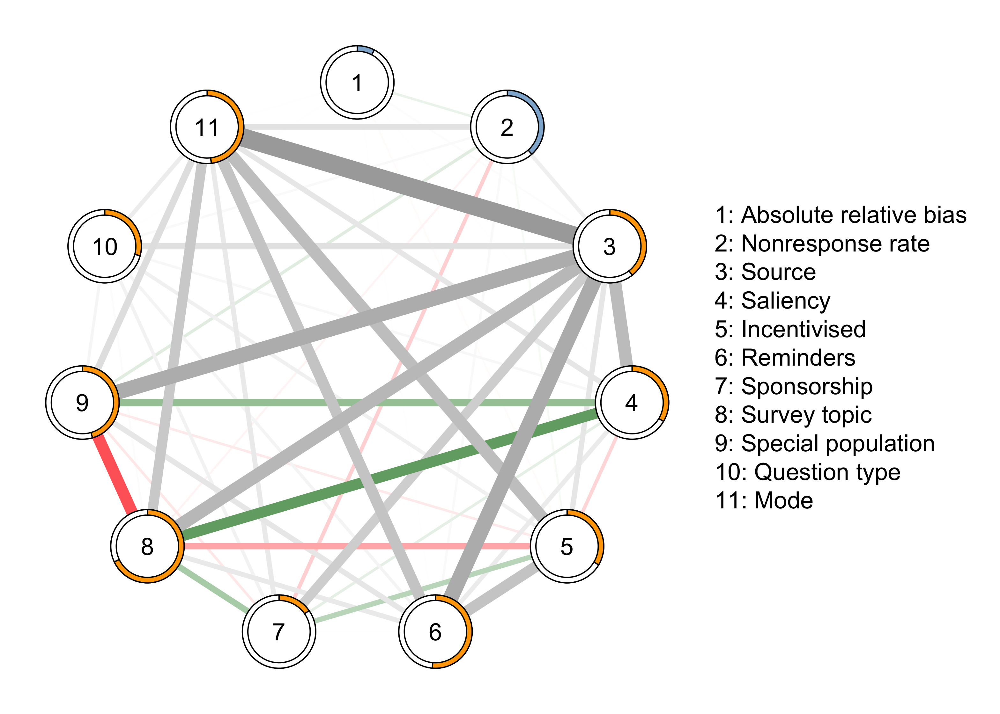
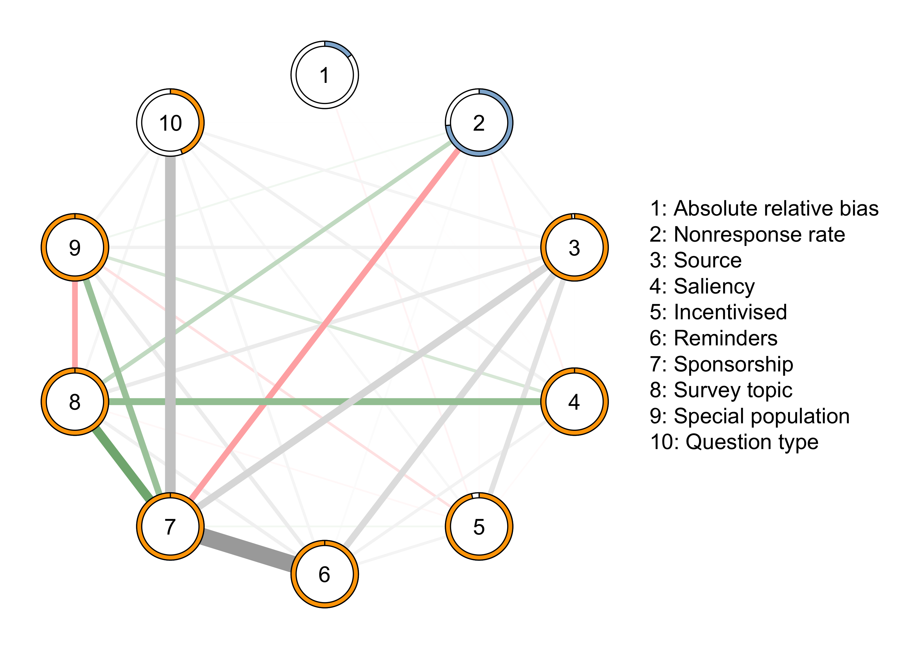
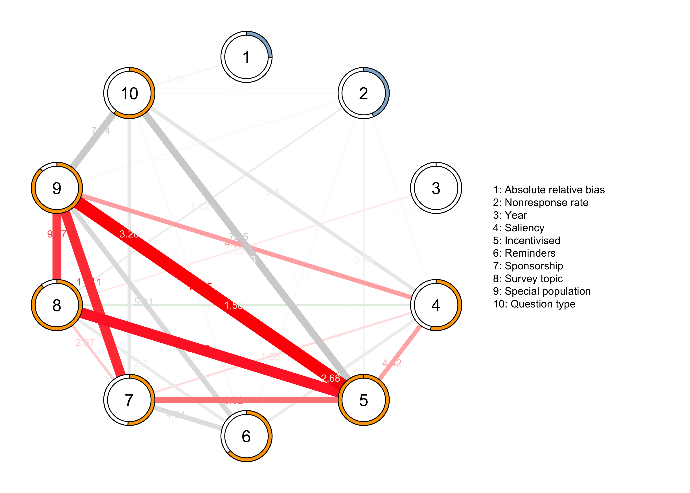
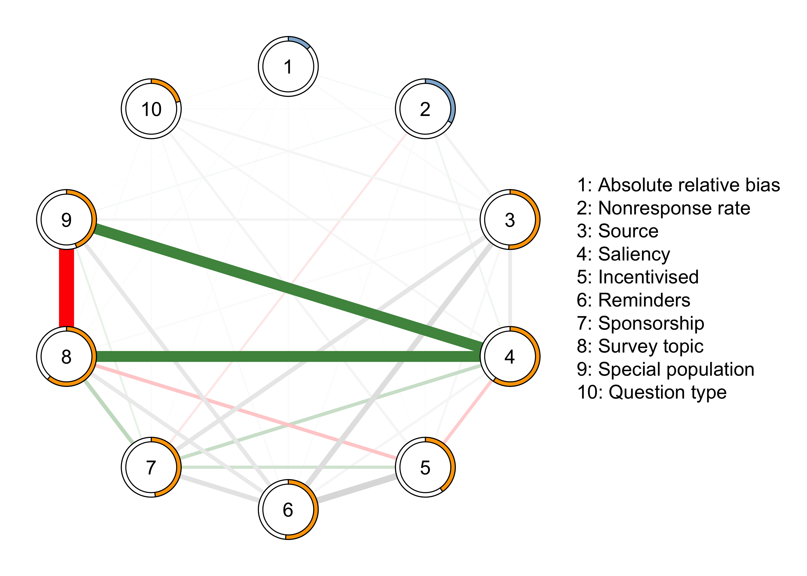
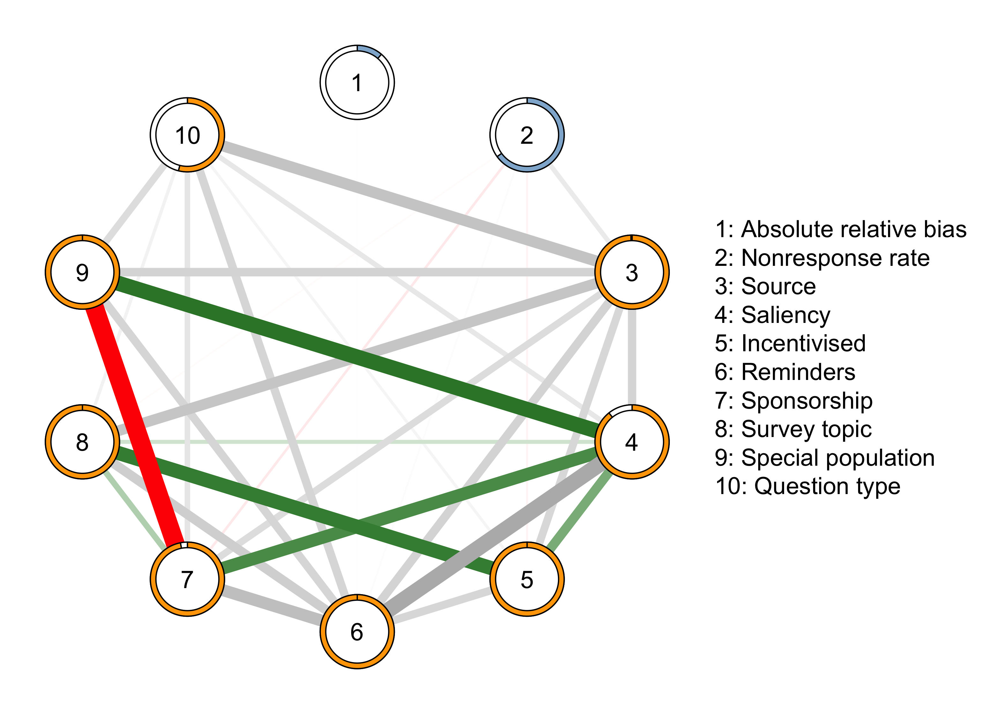

# Network: all

```{r, include=F}
library(qgraph)
library(mgm)
```

```{r, echo = FALSE, out.width="100%", fig.cap ="Network Model of Mail Surveys", fig.align='center'}

```

# Network: f2f

```{r, echo = FALSE, out.width="100%", fig.cap ="Network Model of Mail Surveys", fig.align='center'}

```

```{r, include = F, eval=F}
# Interactions - f2f network
## Bias (1) and saliency (4)
showInteraction(object = mgm_f2f, int = c(1, 4))$parameters

## Bias (1) and incentive (5)
showInteraction(object = mgm_f2f, int = c(1, 5))$parameters

## Bias (1) and reminder (6)
showInteraction(object = mgm_f2f, int = c(1, 6))$parameters

## Bias (1) and topic (8)
showInteraction(object = mgm_f2f, int = c(1, 8))$parameters

## Bias (1) and question type (10)
showInteraction(object = mgm_f2f, int = c(1, 10))$parameters

## NR (2) and saliency (4)
showInteraction(object = mgm_f2f, int = c(2, 4))$parameters

## NR (2) and reminders (6)
showInteraction(object = mgm_f2f, int = c(2, 6))$parameters

## NR (2) and topic (8)
showInteraction(object = mgm_f2f, int = c(2, 8))$parameters

## NR (2) and special population (9)
showInteraction(object = mgm_f2f, int = c(2, 9))$parameters

## NR (2) and question type (20)
showInteraction(object = mgm_f2f, int = c(2, 10))$parameters
```

# Network: web

```{r, echo = FALSE, out.width="100%", fig.cap ="Network Model of Mail Surveys", fig.align='center'}

```

```{r, include = F, eval=F}
# Interactions - web network
## Bias (1) and reminders (6)
showInteraction(object = mgm_web, int = c(1, 6))$parameters

## Bias (1) and question type (10)
showInteraction(object = mgm_web, int = c(1, 10))$parameters

## NR (2) and saliency (4)
showInteraction(object = mgm_web, int = c(2, 4))$parameters

## NR (2) and incentives (5)
showInteraction(object = mgm_web, int = c(2, 5))$parameters

## NR (2) and reminders (6)
showInteraction(object = mgm_web, int = c(2, 6))$parameters

## NR (2) and topic (8)
showInteraction(object = mgm_web, int = c(2, 8))$parameters

## NR (2) and special population (9)
showInteraction(object = mgm_web, int = c(2, 9))$parameters

## NR (2) and question type (10)
showInteraction(object = mgm_web, int = c(2, 10))$parameters
```

# Network: mail

```{r, echo = FALSE, out.width="100%", fig.cap ="Network Model of Mail Surveys", fig.align='center'}

```

```{r, include = F, eval=F}
# Interactions - mail network
## Bias (1) and nonresponse (2)
showInteraction(object = mgm_mail, int = c(1, 2))$parameters

## Bias (1) and reminders (6)
showInteraction(object = mgm_mail, int = c(1, 6))$parameters

## Bias (1) and question type (10)
showInteraction(object = mgm_mail, int = c(1, 10))$parameters

## NR (2) and year (3)
showInteraction(object = mgm_mail, int = c(2, 3))$parameters

## NR (2) and saliency (4)
showInteraction(object = mgm_mail, int = c(2, 4))$parameters

## NR (2) and incentives (5)
showInteraction(object = mgm_mail, int = c(2, 5))$parameters

## NR (2) and reminders (6)
showInteraction(object = mgm_mail, int = c(2, 6))$parameters

## NR (2) and sponsorship (7)
showInteraction(object = mgm_mail, int = c(2, 7))$parameters

## NR (2) and topic (8)
showInteraction(object = mgm_mail, int = c(2, 8))$parameters

## NR (2) and special population (9)
showInteraction(object = mgm_mail, int = c(2, 9))$parameters

## NR (2) and question type (10)
showInteraction(object = mgm_mail, int = c(2, 10))$parameters
```

# Network: tel

```{r, echo = FALSE, out.width="100%", fig.cap ="Network Model of Mail Surveys", fig.align='center'}

```

```{r, include = F, eval=F}
# Interactions - tel network

## Bias (1) and reminders (6)
showInteraction(object = mgm_tel, int = c(1, 6))$parameters

## NR (2) and year (3)
showInteraction(object = mgm_tel, int = c(2, 3))$parameters

## NR (2) and reminders (6)
showInteraction(object = mgm_tel, int = c(2, 6))$parameters

## NR (2) and sponsorship (7)
showInteraction(object = mgm_tel, int = c(2, 7))$parameters

## NR (2) and topic (8)
showInteraction(object = mgm_tel, int = c(2, 8))$parameters
```