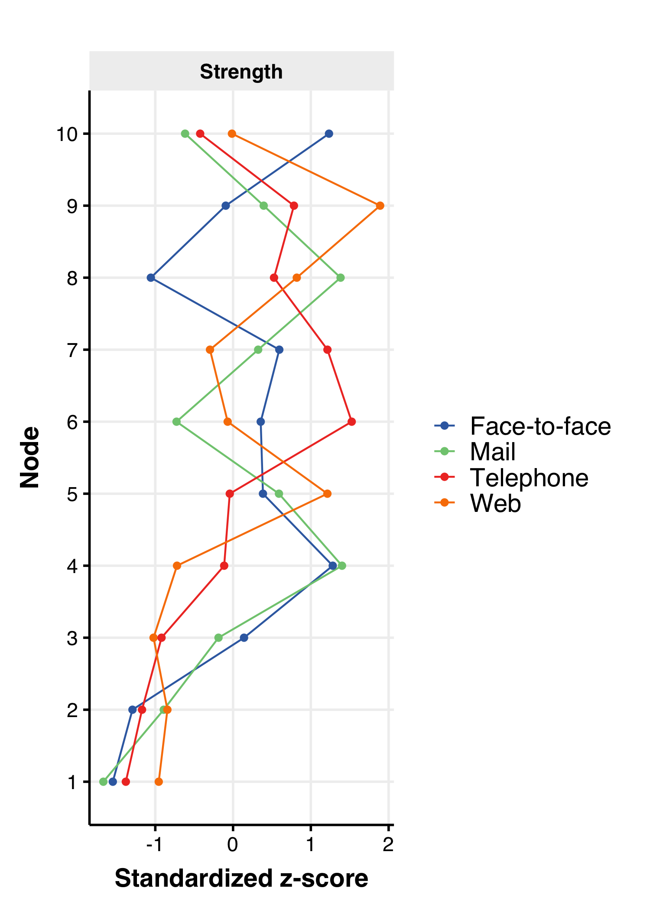

```{r setup, include=FALSE}
library(tinytex)
library(dplyr)
library(kableExtra)
library(gtsummary)
library(kableExtra)
library(knitr)

knitr::opts_chunk$set(
    echo      = FALSE,
    message   = FALSE,
    warning   = FALSE,
    fig.pos   = "H",
    out.extra = ""
)

options(tinytex.verbose = TRUE,
        knitr.kable.NA = '-')
```

```{r, echo = FALSE}
# Load the data
df_ints_overall <- readRDS("../analysis/data/output/df_ints_overall.RDS")
df_ints_overall_p1 <- df_ints_overall[[1]]
df_ints_overall_p2 <- df_ints_overall[[2]]

df_ints_f2f <- readRDS("../analysis/data/output/df_ints_f2f.RDS")
df_ints_f2f_p1 <- df_ints_f2f[[1]]
df_ints_f2f_p2 <- df_ints_f2f[[2]]

df_ints_tel <- readRDS("../analysis/data/output/df_ints_tel.RDS")
df_ints_tel_p1 <- df_ints_tel[[1]]
df_ints_tel_p2 <- df_ints_tel[[2]]

df_ints_mail <- readRDS("../analysis/data/output/df_ints_mail.RDS")
df_ints_mail_p1 <- df_ints_mail[[1]]
df_ints_mail_p2 <- df_ints_mail[[2]]

df_ints_web <- readRDS("../analysis/data/output/df_ints_web.RDS")
df_ints_web_p1 <- df_ints_web[[1]]
df_ints_web_p2 <- df_ints_web[[2]]

# Node names
nodes <- c("N1", "N2", "N3", "N4.0", "N4.1", "N5.0", "N5.1", "N6.0", "N6.1", "N7.0", "N7.1", "N8.0", "N8.1", "N9.0", "N9.1", "N10.0", "N10.1","N10.2", "N11.0", "N11.1", "N11.2", "N11.3", "N11.4")
```

# SUPPLEMENTARY MATERIAL

\vspace{0.5cm}
\hrule
\vspace{0.5cm}

## A: Network Node Interactions and Interpretation

In the main paper, the network edge weights represent the aggregate interactions between a pair of nodes. That is, for a given pair of nodes an effect is estimated in two directions: N1-->N2 and N2-->N1. The average of these two interactions gives us the single edge weight parameter. In the tables below, the disaggregated interactions are given for each network in the main paper. We provide this for the following reasons: **(1)** Readers might be interested only in the effect of N1-->N2 and not the reciprocal, for theoretical reasons. **(2)** Sometimes, an effect between a pair of nodes in a certain direction make less theoretical sense. For example, we expect the year of publication to bear effect on the response rates due to the general trends in the literature, but it makes less sense to expect the response rate to have an effect on the year. **(3)** Readers can inspect the size or strength (weight) of the disaggregated parameters, which is interesting in cases where the effect in one direction contributes more to the average edge weights.

The tables below present a lot of information. To understand it, readers should know that nodes are labelled N1 through to N11 and their levels follow the decimal. So for Node 11, which is survey modes, N11.1 is the first categorical level (following the same order that is presented in the main paper). This means that N11.0 represents "paper", N11.1 represents "face-to-face", N11.2 represents "mail", N11.3 represents "web", and N11.4 represents "telephone" surveyrs. For nodes with just two levels (i.e., binary), the .0 always representes "No" and the .1 always represents "Yes". Lastly, the left-side of the table is where the nodes in the rows are predicting the nodes in the columns. The right-side of the table is where the nodes in the columns are predicted the rows. So, in the left-side the first parameter represents N1-->N2 and the right-side the first parameter represents N2-->N1.

### A.1: Continuous by Continuous Interactions

Interpreting two continuous nodes is very simple, as the parameters represent correlations that are either positive or negative. 

### A.2: Continuous by Categorical Interactions

As mentioned, the `mgm` package used employs a nodewise estimation approach. The interaction between survey mode and nonresponse rates, involves predicting a continuous variable (nonresponse rates) with a categorical variable (survey mode), *and* predicting a categorical variable  (survey mode) with a continuous variable (nonresponse rates). In the first instance, the first category is used as the reference category as in a traditional regression framework. 

* Insert example from Table 1

In the second instance, the categorical variable, survey mode, is predicted by the continuous variable, nonresponse rates. Here the probability of each categorical level is modelled. If the parameter is negative, then nonresponse rates decrease the probability of a given category. Conversely, positive parameters mean that nonresponse rates increase the probability of a given category.

* Insert example from Table 1

### A.3: Categorical by Categorical Interactions

The interaction between two categorical nodes can be interpreted as probabilities. Consider the variables survey mode (Node 11) and topic saliency (Node 4), we can see that face-to-face surveys (N11.1) increases the probability of the topic being salient (N4.1) relative to the reference of paper surveys (N11.0). When the direction of the regression is reversed, the interpretation remains the same. 

\begin{landscape}

```{r param1, eval=T, echo=FALSE}
t_all_parameters <- cbind(df_ints_overall_p1, df_ints_overall_p2) %>% as.data.frame()
colnames(t_all_parameters) <- rep(nodes, 2)
rownames(t_all_parameters) <- nodes

t_all_parameters %>% 
  kbl(
      digits = 2,
      booktabs = TRUE, 
      linesep  = "",
      caption  = "Disaggregated interactions between all node levels in the overall network."
  ) %>% 
  kable_classic(font          = 12,
                position      = "center",
                latex_options = c("scale_down", "HOLD_position"),
                full_width    = F) %>% 
  add_header_above(c(" " = 1, "Predict Columns" = 23, "Predict Rows" = 23)) %>% 
  column_spec(1, bold = TRUE) %>% row_spec(0, bold = TRUE, angle = 90)
```

\newpage

```{r param2, eval=T, echo = FALSE}
t_f2f_parameters <- cbind(df_ints_f2f_p1, df_ints_f2f_p2) %>% as.data.frame()
colnames(t_f2f_parameters) <- rep(nodes[1:18], 2)
rownames(t_f2f_parameters) <- nodes[1:18]

t_f2f_parameters %>% 
  kbl(
      digits = 2,
      booktabs = TRUE, 
      linesep  = "",
      caption  = "Disaggregated interactions between all node levels in the face-to-face network."
  ) %>% 
  kable_classic(font          = 12,
                position      = "center",
                latex_options = c("scale_down", "HOLD_position"),
                full_width    = F) %>% 
  add_header_above(c(" " = 1, "Predict Columns" = 18, "Predict Rows" = 18)) %>% 
  column_spec(1, bold = TRUE) %>% row_spec(0, bold = TRUE, angle = 90) 
```

```{r param3, eval=T, echo = FALSE}
t_tel_parameters <- cbind(df_ints_tel_p1, df_ints_tel_p2) %>% as.data.frame()

colnames(t_tel_parameters) <- rep(nodes[1:18], 2)
rownames(t_tel_parameters) <- nodes[1:18]

t_tel_parameters %>% 
  kbl(
      digits = 2,
      booktabs = TRUE, 
      linesep  = "",
      caption  = "Disaggregated interactions between all node levels in the telephone network."
  ) %>% 
  kable_classic(font          = 12,
                position      = "center",
                latex_options = c("scale_down", "HOLD_position"),
                full_width    = F) %>% 
  add_header_above(c(" " = 1, "Predict Columns" = 18, "Predict Rows" = 18)) %>% 
  column_spec(1, bold = TRUE) %>% row_spec(0, bold = TRUE, angle = 90)
```

```{r param4, eval=T, echo = FALSE}
t_mail_parameters <- cbind(df_ints_mail_p1, df_ints_mail_p2) %>% as.data.frame()
colnames(t_mail_parameters) <- rep(nodes[1:18], 2)
rownames(t_mail_parameters) <- nodes[1:18]

t_mail_parameters %>% 
  kbl(
      digits = 2,
      booktabs = TRUE, 
      linesep  = "",
      caption  = "Disaggregated interactions between all node levels in the network."
  ) %>% 
  kable_classic(font          = 12,
                position      = "center",
                latex_options = c("scale_down", "HOLD_position"),
                full_width    = F) %>% 
  add_header_above(c(" " = 1, "Predict Columns" = 18, "Predict Rows" = 18)) %>% 
  column_spec(1, bold = TRUE) %>% row_spec(0, bold = TRUE, angle = 90)
```

```{r param5, eval=T,echo = FALSE}
t_web_parameters <- cbind(df_ints_web_p1, df_ints_web_p2) %>% as.data.frame()
colnames(t_web_parameters) <- rep(nodes[1:18], 2)
rownames(t_web_parameters) <- nodes[1:18]

t_web_parameters %>% 
  kbl(
      digits = 2,
      booktabs = TRUE, 
      linesep  = "",
      caption  = "Disaggregated interactions between all node levels in the web network."
  ) %>% 
  kable_classic(font          = 12,
                position      = "center",
                latex_options = c("scale_down", "HOLD_position"),
                full_width    = F) %>% 
  add_header_above(c(" " = 1, "Predict Columns" = 18, "Predict Rows" = 18)) %>% 
  column_spec(1, bold = TRUE) %>% row_spec(0, bold = TRUE, angle = 90) 
```

\end{landscape}


## B: Centrality Indices

Centrality indices are a group of measures that tell us different aspects of the importance of nodes in a network. In Figure 1, the *node strength* for each network model is shown. Strength centrality tells us which node has the largest edge weights in the network and is different for each one. By this metric, topic saliency (Node 4) is the most central node in the face-to-face and mail network. In web surveys, the most central node is the population type and in telephone surveys the most central node is the use of reminders. 

Face-to-face surveys are almost exclusively interviewer-led, presenting opportunities to make the purpose of the survey more salient to the respondent (hence topic saliency becomes most central). The reasons for the centrality of topic saliency in mail surveys is less clear. It is possible that mail surveys are often specific to the recipient (e.g., healthcare follow-up surveys) or feel more obligatory (e.g., national surveys), adding to the saliency. Reminders are probably central in telephone surveys due to the ease at which telephone reminders can be administered in addition to the probable chance the respondent misses the first phone call. It is also unclear why the population type is so central to web surveys, but note that incentives are not far behind. 

```{r, echo = F, fig.align='center', out.width="50%", out.height="50%", fig.ncol = 2, fig.cap='Strength Centrality for all Network Models.', fig.subcap=c('All modes', 'Centrality Measure')}


```

\newpage

## C: Robustness Analysis

As the parameters of these network models are *estimated* from data (i.e., not observed), it is crucial to assess the robustness of the models. Parameter estimation is vulnerable to low sample sizes and class imbalance, which are features of our stratified networks. We assessed robustness in two ways: **(1)** by bootstrapping the accuracy of edge-weights; and **(2)** bootstrapping the stability of centrality indices. 

The bootstrapped edge-weights are presented in Figure 2, for each network model: overall, face-to-face, telephone, mail, and web. Unsurprisingly, the edge-weights are most accurate for the networks with larger sample sizes (overall, mail). In the face-to-face, web, and telephone networks edge-weights are often estimated to be zero, indicating the absence of an edge in all bootstrapped samples. Moreover, the shaded region reveal that some edge-weights have considerably wide confidence intervals and there are occasions when the bootstrapped and original sample mean markedly diverge. Although the sample size within each network is sufficient for estimation, the class imbalance over the categories of some survey design characteristics are the likely culprits. In part, this is a genuine effect of survey design, where certain design choices are common to a mode. However, the `mgm` package cannot handle missingness and further casewise deletion during estimation exacerbates the class imbalance. Future work should aim to collect enough data to have more balanced classes. 

Figure 3 presents the correlation of the bootstrapped centrality indices with the centrality indices of the original sample. Correlations remain high even as the percentage of subsamples dropped from the data increase, meaning stability is excellent overall and never drops below the minimum recommendation (black line). Ergo, we are confident that the centrality indices estimated in the original samples is not dependent on particular observations (subsamples) of the data and are representative of the population of surveys. 

\newpage

\begin{landscape}

```{r, echo=F, fig.align='center', out.width='20%', out.height='100%', fig.ncol = 5, fig.cap='Nonparametric bootstrap samples (n=1000) of network edges and their confidence intervals (blue line and shaded region) plotted against the original sample edges (yellow line).', fig.subcap=c("All modes", "Face to face", "Telephone", "Mail", "Web")}

include_graphics(c("../analysis/img/boot_plots/p_np_accuracy_all.png",
                   "../analysis/img/boot_plots/p_np_accuracy_f2f.png",
                   "../analysis/img/boot_plots/p_np_accuracy_tel.png",
                   "../analysis/img/boot_plots/p_np_accuracy_mail.png",
                   "../analysis/img/boot_plots/p_np_accuracy_web.png"))
```

\end{landscape}
\newpage


```{r, echo=F, fig.align='center', out.width='50%', out.height='20%', fig.ncol = 2, fig.cap='Case-dropping bootstrap samples (n=1000) of centrality indices (node strength) correlated with the centrality indices in original sample. Node strength is a stable measure across all networks', fig.subcap=c("All modes", "Face to face", "Telephone", "Mail", "Web")}

knitr::include_graphics(c("../analysis/img/boot_plots/p_cd_stability_all.png",
                         "../analysis/img/boot_plots/p_cd_stability_f2f.png",
                         "../analysis/img/boot_plots/p_cd_stability_tel.png",
                         "../analysis/img/boot_plots/p_cd_stability_mail.png",
                         "../analysis/img/boot_plots/p_cd_stability_web.png"))
```

