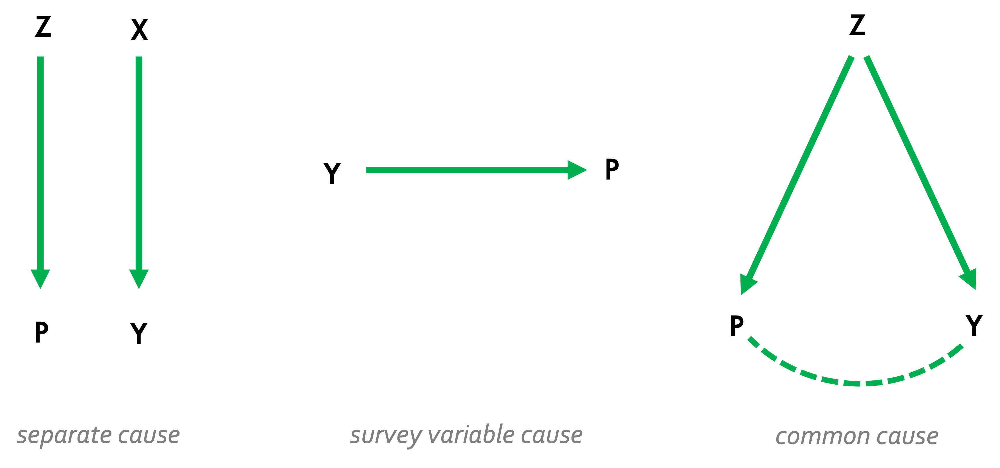
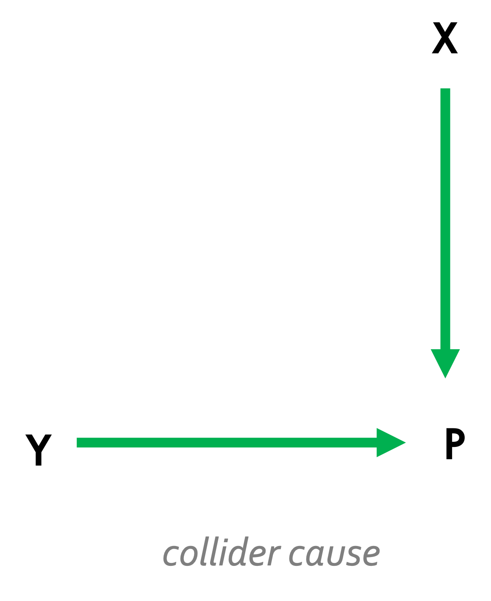
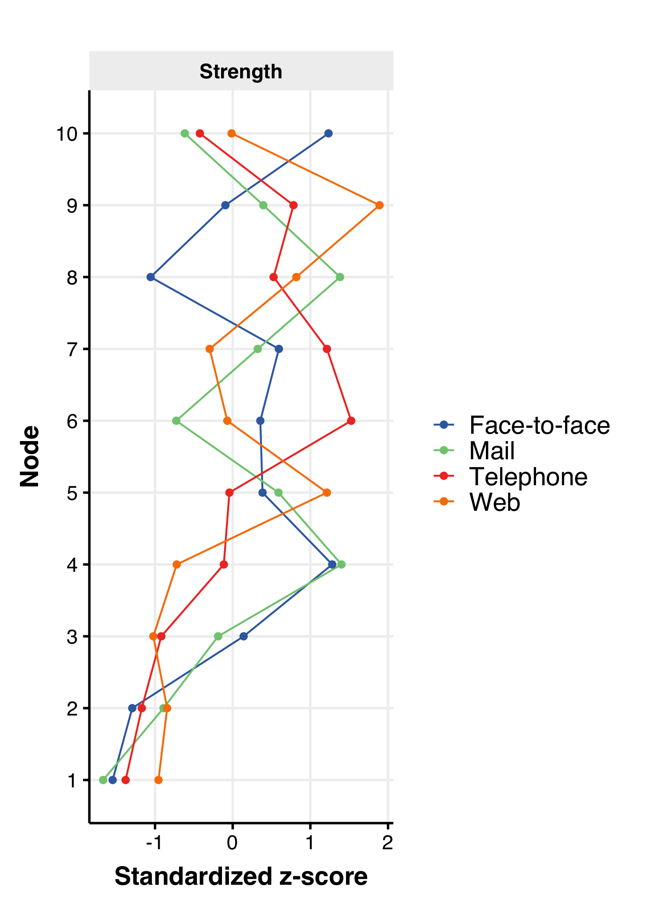

```{r setup, include=FALSE}
library(tinytex)
library(dplyr)
library(kableExtra)
library(gtsummary)
library(kableExtra)
library(knitr)

knitr::opts_chunk$set(
    echo      = FALSE,
    message   = FALSE,
    warning   = FALSE,
    fig.pos   = "H",
    out.extra = ""
)

options(tinytex.verbose = TRUE,
        knitr.kable.NA = '-')
```

\begin{titlepage}
  \begin{center}
  \vspace{1cm}
  \begin{flushleft}
  \textbf{\MakeUppercase{\LARGE{\vspace{10pt}\articletitle}}}
  \end{flushleft}
  \vspace{1cm}
  \hrule
  \vspace{1.5cm}
  \textbf{\MakeUppercase{\authorname\textsuperscript{1}\textsuperscript{*}}}\\
  \vspace{0.5cm}
  \textbf{\MakeUppercase{\textsuperscript{1}\affiliation}}\\
  \vspace{1cm}
  \begin{abstract}
    \abstracttext
  \end{abstract}
  \vspace{0.5cm}
  \textbf{Keywords:} \keywords
  \vfill
  \end{center}
  {\textsuperscript{*}\contactinfo} \\
  \vspace{0.5cm}
  \textit{Journal of Survey Statistics and Methodology}
    \renewcommand*{\thefootnote}{\fnsymbol{footnote}}
    \footnotetext{\acknowledgments}
\end{titlepage}

\newpage

\doublespacing

# Introduction

Survey response rates have suffered a consistent decline over the years [@czajka2016; @beullens2018; @schoeni2012' @brick2013 @lipps2009]. One implication of poor response rates is the increased risk for nonresponse bias. Smaller sample sizes also reduce statistical power, and the overall precision of estimates suffers [@lohr2021]. Theoretially, traditional probability samples require a 100% response rate to achieve completely unbiased estimates. Consequently, practitioners are willing to spend a considerable portion of their survey budget on enhancing fieldwork efforts, advertising campaigns, and offering financial incentives to boost response rates [@sakshaug2022; @mcgonagle2020; @beebe2018; @lipps2010; @southern2008: @curtin2000]. A key question is if, given the empirical evidence, directing significant effort to maximising response rates is really worth it when reducing nonresponse bias is our goal. 

The European Social Survey (ESS) is a cross-national and longitudinal survey measuring attitudes, beliefs, and behaviours across countries in Europe that puts considerable investment in limiting nonresponse. The ESS has an extensive fieldwork period of six weeks over the course of five months to achieve their target response rate of 70%. As such, fieldwork efforts have increased wave-to-wave with more non-contact attempts made, more attempts to convert refusals, increasing the use of prenotification and offering incentives to name a few [@beullens2018]. The overall cost of fieldwork comes to €4.2m [@ess2016]. Yet, ESS response rates are still declining at each wave. Fortunately for the ESS, the differences between respondents and nonrespondents are minimal and nonresponse bias appears stable [@beullens2018]. There are even some cases when increasing the response rate has led to an *increase* in nonresponse bias [@beullens2012]. This can arise if the converted nonrespondent is very unwilling such that their responses actually increase the measurement error, in turn increasing nonresponse bias [@tourangeau2010]. Having a very long fieldwork period can similarly lead to increased nonresponse bias if certain types of individuals are more likely to respond early or late. A study by @struminskaya2022 found that a fieldwork period of 2 weeks is optimal in web surveys (although note that this is in the context of a panel survey which is very different to cross-sectional surveys). This also indicates that the length of fieldwork should be determined by the point at which nonresponse bias is no longer significant, rather than when response rates reach equilibrium. The paradoxical trend of declining response rates that coincide with low nonresponse bias add further confusion. In a cross-national online survey conducted in Great Britain, Estonia, and Slovenia, the most representative sample came from the country with the lowest response rates (Great Brtain) [@maslovskaya2022]. Other auxiliary information was more indicative of nonresponse bias, such as age (in Great Brtain) and level of education (in Estonia and Slovenia). These studies and more indicate that response rates alone are a poor predictor of nonresponse bias [@koch2014; @lee2009; @groves2006; @groves2008; @groves2006].

The most extensive work on this issue comes from two studies [@groves2008; @groves2006]. In one, the authors attempted to produce nonresponse bias by experimentally manipulating survey design and response propensity. Participants were randomly assigned to survey topics they had varying degrees of interest in and that either offered incentives or not but failed to find any consistent pattern. In part, this was due to the different effects of survey mode on participation; in this case mail surveys yielded lower response rates as there was less opportunity to make the topic salient to respondents. In a second experiment, the authors compared the differences in estimates of the birding population by surveying those with and without a special interest in birding. The special interest group and the general group yielded very different estimates, but this practically vanished when incentives were offered to the disinterested group. @groves2006 concluded that the relationship between response rates and nonresponse bias is complex and that survey topic, mode, saliency, and incentives have the power to change this relationship.

In a later meta-analysis of 59 different studies on nonresponse, the authors sought to extend these findings by incorporating a wider range of survey design features and sample attributes. Only mode (self- or interviewer-administered), sponsorship, population type (specific or general), and the type of question (behavioural, attitudinal, demographic) showed significant differences between respondents and nonrespondents. Specifically, bias was greater for interviewer-administered surveys, surveys involving the general population, and questions about attitudes [@groves2008]. Unfortunately, many of the existing studies have important methodological drawbacks that compromise their claims. For instance, @groves2008 meta-analysis suffered a small sample size that overrepresented self-administered surveys, health surveys, and limited them to simplistic bivariate analyses that are unlikely to capture the multivariate nature of nonresponse bias. Others focus on particular surveys and modes [@rybak2023; @kohler2022; @mcgonagle2020; @bethlehem2010] or are based on theoretical simulations rather than empirical data [@hua2023; @beullens2012]. Another shortcoming of the literature is the limited use of causal inference in investigating the link between nonresponse and bias especially given the multivariate nature of it (but see @kohler2022 and @mercer2017). These studies demonstrate that nonresponse bias is a variable-specific phenomenon. A number of theoretical frameworks have been proposed over the years that explain why this is the case. Leverage-saliency theory [@groves2000], response-propensity theory [@brick2017], and benefit-cost theory [@singer2011] all present a similar case: survey participation decisions balance the participation-benefits and participation-costs, certain aspects of a survey design have leverages on a person's participation and the saliency of these leverages can be manipulated to increase their response propensity, and when response propensities are correlated with the survey outcome nonresponse bias occurs. Consensus on these theories has urged a shift in how we think about nonresponse bias.

In this paper, we first explain how nonresponse and nonresponse bias arise using different causal models of survey response. Next, we describe our own meta-analysis of surveys on nonresponse and analyse the statistical relations among a detailed set of survey design characteristics using graphical network modelling. Our aim is to encourage more causal thinking when it comes to survey inference and to explore the utility of an innovative method for analysing causal structures in survey data.

# Background

## Nonresponse Bias

Nonresponse bias occurs when the sampled units (realised respondents) differ systematically from the non-sampled units (nonrespondents). The Total Survey Error (TSE) framework identifies nonresponse (along with noncoverage) as one of the major contributors to bias [@biemer2010]. Indeed, the American Association of Public Opinion Research (AAPOR) insist practitioners should be "maximising the number of people who respond to your survey" by increasing incentives, contact attempts, and converting refusals [@aapor2022]. The persistence of response rates as an indicator of survey quality may, in part, be due to this stance. An additional attraction is the theoretical simplicity with which nonresponse rate can relate to nonresponse bias, highlighted by the formula from @bethlehem1988:

```{=tex}
\begin{subequations}\label{eqn1}
\begin{align*}
NR_{bias}(\bar{y}_r) &= \frac{\sigma_{p_i,\mu_i}}{\bar{P}} \tag{\ref{eqn1}} \\
\; \textrm{where}, \\
\bar{y}_r            &= \textrm{the value of the survey outcome for respondent r}, \\
\sigma_{p_i,\mu_i}   &= \textrm{the covariance of survey outcome and response propensity for individual i},\\
\bar{P}              &= \textrm{the mean response propensity} \\
\end{align*}
\end{subequations}
```

Equation 1 implies that when $\bar{P}$ is high the nonresponse bias is low, ceteris paribus. However, if $\sigma_{p_i,\mu_i}$ increases then nonresponse bias will too. Increasing the response rate is only worth it if the decrease in bias that it causes is greater than the increase caused by $\sigma_{p_i,\mu_i}$. In response, researchers make the maximisation of response rates a primary goal, even moving away from traditional probability-based sampling procedures in favour of lower cost nonprobability surveys that can be fielded faster and achieve higher response rates [@cornesse2020]. It is also standard for cross-sectional and longitudinal surveys always report response rates [@draugalis2008; @fincham2008] despite underwhelming or even contradicting evidence of its impact on bias [@hedlin2020; @gummer2019; @lee2009; @groves2006; @groves2008; @keeter2000]. Some have even called for new indicators of survey representativeness, the so-called R-indicators [@bethlehem2008]. Before we conclude an absence of a relation between response rate and nonresponse bias, we should consider the situations where one does give rise to the other and how we might control for this.

## Causal Mechanisms of Nonresponse Bias

Nonresponse is typically categorised as ignorable or non-ignorable [@hedlin2020; @fay1986]. If nonresponse has no connection to the survey outcome, we can safely assume that responses are missing completely at random (MCAR) [@little2002] and therefore is ignorable (i.e., $\sigma_{p_i,\mu_i} = 0$ and nonresponse bias is not a concern). In surveys, this is why probability-based sampling is the gold standard. In probability surveys, all sampled units have an equal probability of responding and any associated missingness would be random. In the causal inference literature, this is called strong ignorability which has two requirements: (conditional) exchangeability and positivity.

Conditional exchangeability is met when all possible confounding variables are known and measured for all of the sampled units such the causal effect is estimable when these variables are controlled for [@greenland1986]. In this case data are missing at random (MAR) [@little2002]. Exchangeability is unconditional when data are MCAR. 

Positivity simply ascertains that all sampled units have an equal probability to participate in the survey [@hernan2006; @petersen2012]. Probability sampling ensures this. If positivity and (conditional) exchangeability are met, we can be confident that the composition of the sample is sufficiently alike the population to estimate causal effects. In reality, probability-sampling rarely achieves the 100% response rate required to guarantee the conditions for causality. Nonprobability sampling is also becoming more popular [@cornesse2020] under which we can not assume anything about $\sigma_{p_i,\mu_i}$. Numerous statistical methods have been developed to relate the sample back to the population when nonresponse is present and nonresponse bias is a concern [@toepoel2017; @lee2011; @gary2007; @lundstrom1999]. Still, conditional exchangeability (thus causal inference) relies on correctly specifying these models.

The assumptions in the MAR case are only met if we condition on the *right* variables. The challenge is in deciding what these variables are. If we believe that the design of a survey influences the response rate and in turn the amount of nonresponse bias, we should condition on these. For example, certain survey modes such as face-to-face achieve higher response rates and one might expect nonresponse bias to be low. Conversely, mail surveys have lower response rates and so should have greater nonresponse bias. Within a survey mode, however, other choices such as the survey topic or incentivising particpants will also bear consequences for the response rate and corresponding bias. It becomes obvious that understanding the complex mechanisms that give rise to nonresponse bias is pertinent to accurate estimation of causality in surveys. In the section below, we outline some potential mechanisms that give rise to nonresponse bias and threaten causal conclusions in surveys.

## Graphical Models of Nonresponse Bias

Graphical causal models for survey inference are not a new idea [@kohler2022; @mercer2017; @groves2006a; @fay1986], but their use is limited and mostly informal. Figures 1 and 2 depict three causal models that have been adapted from @groves2006a. In each of the causal graphs:

```{=tex}
\begin{itemize}
\item $P$ is the propensity to respond
\item $Y$ is the estimated survey outcome
\item $Z$ and $X$ are independent survey variables
\end{itemize}
```

```{r, echo = FALSE, out.width ="70%", fig.cap ="Three causal graphs, adapted from Groves (2006). P is the latent response propensity and Y is the survey outcome. Z and X indicate separate potential causes for P and Y. Nonresponse bias occurs when P and Y are correlated (centre and right).", fig.align='center'}

```

```{r, echo = FALSE, out.width ="25%", fig.cap ="Extension of the survey variable cause graph.", fig.align='center'}

```


The *separate cause* scenario is the most ideal. Response propensity, $P$, and the survey outcome, $Y$, have independent and separate causes, $Z$ and $X$. Thus, it is impossible for a covariance to exist between the survey outcome and response propensities, and we do not expect any nonresponse bias. The *survey variable cause* scenario illustrates a less desirable scenario where the survey outcome of interest at least partly causes response propensities to change. For example, a survey that intends to estimate the effectiveness of a new medication for depression may overestimate the benefits because people who responded well to the medication are more likely to respond. The *collider cause* is an extension of this scenario where an additional independent variable, $X$, also affects the response propensity but is independent of $Y$. Because we are forced to rely on those who have a high response propensity, we may suffer from collider bias where a spurious connection between $X$ and $Y$ exists in-sample but not in the population. Continuing with our example, in addition to receiving more responses that are positive we may also receive more responses from women (it is often observed that women response more often to surveys than men [@becker2017; @elliott2005]). As a result, a spurious correlation is induced making it seem as if women respond more positively to the new medication than men. Lastly, in the *common cause* scenario the response propensity, $P$, and the survey outcome, $Y$, share a common cause, $Z$. In our motivating example, $Z$ could be adherence to a treatment plan. Adherence affects the treatment outcome because better taking the medication consistently is of more benefit. Adherence also affects the propensity to respond because those who adhered are also more invested in their health and more likely to participate in health-related surveys. In the same way, those who did not adhere to the treatment plan are less likely to respond to avoid judgement. Again, we see a positive bias in our estimate of the treatment effect because response propensity and the survey outcome are related through their shared cause of treatment adherence. In the *separate cause* scenario, the survey outcome and response propensity are d-separated (independent) (see @pearl2009 for a thorough discussion of d-separation). In the other scenarios nonresponse covaries with the survey outcome, resulting in non-ignorable nonresponse bias. However, d-separation is possible by conditioning on the correct covariate. If we control for both gender and treatment adherence, with some statistical tricks, we can estimate a more accurate causal effect by blocking the spurious paths.

Although research has indicated that nonresponse bias is likely to be outcome-specific within surveys, there is a lack of consensus on which survey-related characteristics may induce a relationship between nonresponse and nonresponse bias at the between-survey level. Furthermore, some between-survey characteristics may influence those within-survey aspects that relate to nonresponse and bias [@tourangeau2017]. For instance, a health survey is intrinsically salient to those who are invested in their health, but offering an incentive can increase the saliency to those feeling less invested.

Our study aims to understand these complex mechanisms by estimating a structural network of conditional (in-)dependencies among a broader set of survey design characteristics based on our own meta-analysis of surveys about nonresponse rate and nonresponse bias that greatly expands the sample size of previous meta-analyses. We also discuss the utility of network modelling as method for potential causal inference in surveys. In the next section we describe our data collection and analysis methods.

# Methods

In our research, we conducted a systematic review of the literature on nonresponse rates, nonresponse bias, and survey characteristics (section 3.1; Table 1). Using a network modelling approach, we estimated the conditional (in)-dependencies between several survey design characteristics, estimating centrality indices (i.e., node strength) for each network, and assessing the robustness of the network edge-weights and centrality indices (section 3.3). All code used in preprocessing, statistical analysis, and processing of the results is publicly available (section 3.4). Ethical approval for the research conducted was granted by the FETC under file number 22-2063.

## Literature Search and Data

Our data arises from a meta-analysis of estimates of nonresponse rate and nonresponse bias from 187 studies. Studies were identified from a systematic search of the literature that was based on the strategy implemented by @groves2008. Articles were identified from five electronic databases: Google Scholar, Web of Science, Scopus, Web Survey Methodology and PsychInfo. Additional sources included conference proceedings (e.g., the American Statistical Association Survey Research Methods section), articles cited in book chapters (e.g., Wiley Series in Survey Methodology), and internet searches of the key terms to obtain a wide range of articles and grey literature. The primary search criteria were that the study contained a survey and recorded nonresponse rates and nonresponse bias for that survey. Example of the search terms are *response bias, nonresponse bias, selection bias, survey bias, participation rates*. Further inclusion criteria were:

1.  Article contains an empirical study about nonresponse rates.
2.  A probability-sample is drawn from a population.
3.  A survey is conducted.
4.  Sample frame information is available for respondents and nonrespondents.

Screening of the initial search results was aided by the automatic screening tool ASReview (v0.19.1) [@vandeschoot2022; @vandeschoot2021]. Since all articles considered in the meta-analysis by @groves2008 were granted automatic inclusion, we used them as the training set for ASReview. ASReview returns the articles predicted as relevant or irrelevant according to the training set. Five independent researchers quality checked the output from ASReview by manually coding their relevance, stopping when 25 consecutive articles were coded as irrelevant. Articles that were incorrectly predicted by ASReview were amended. Articles about panel surveys were excluded as the pattern of nonresponse is more complicated than for cross-sectional surveys. The process resulted in 187 studies as described in Figure 2

```{r, echo = FALSE, fig.align='center', out.width='60%', out.height='60%',fig.cap='PRISMA (2020) Flow Diagram'}
knitr::include_graphics("../analysis/img/dags/PRISMA.pdf")
```

The same five independent researchers undertook the task of coding each survey's design characteristics. Most of the characteristics are related to the design of the study (e.g., nonresponse rate, nonresponse bias, survey mode, survey topic, survey incentivisation, survey sponsorship, type of population, use of reminders). Some characteristics are related to the type of outcome statistics (e.g., mean, median, total, or percentage) and the type of question (e.g., attitudinal, demographic, behavioural). An operationalisation of the design characteristics selected for our analysis is presented in Table 1. We note that due to the selected sample, the variation in survey design characteristics is somewhat limited: some categories of the dichotomous variables have very few observations within a particular survey mode. To mitigate this, we selected the characteristics with the most complete cases and that we believe are important for nonresponse rate and nonresponse bias. 

```{r descriptives, echo = FALSE, warning=FALSE}
tab <- readRDS("../analysis/data/input/data.RDS") %>% 
  select(Mode, Topic_Health, Qtype, special_population, Saliency, Incentivised, Reminder, Sponsorship) %>% 
  dplyr::mutate(special_population = ifelse(special_population == "Yes", "Specific", "General")) %>% 
  dplyr::mutate(across(-Mode, ~ if(is.factor(.)) forcats::fct_explicit_na(., na_level = "Unknown") else .))

tab %>% 
  tbl_summary(by           = Mode,
              sort         = all_categorical() ~ "frequency",
              statistic    = list(all_categorical() ~ "{n} ({p}%)"),
              missing      = "ifany",
              label        = list(vars(Topic_Health)       ~ "Topic",
                                  vars(Qtype)              ~ "Question",
                                  vars(special_population) ~ "Population",
                                  vars(Saliency)           ~ "Salient topic",
                                  vars(Incentivised)       ~ "Incentives",
                                  vars(Reminder)           ~ "Reminders",
                                  vars(Sponsorship)        ~ "Sponsorship"
                                  ),
              type        = list(c(Topic_Health, Qtype, special_population, Saliency, Incentivised, Reminder, Sponsorship) ~ "categorical")) %>% 
  
  bold_labels() %>% 
  modify_header(label ~ "Survey Characteristic") %>% 
  modify_spanning_header(c("stat_1", "stat_2", "stat_3", "stat_4", "stat_5") ~ "**Primary Survey Mode**") %>% 
  modify_table_body(~.x %>% dplyr::mutate(stat_1 = ifelse(stat_1 == 0 | stat_1 == "0 (0%)", "-", stat_1),
                                          stat_2 = ifelse(stat_2 == 0, "-", stat_2),
                                          stat_3 = ifelse(stat_3 == 0, "-", stat_3),
                                          stat_4 = ifelse(stat_4 == 0, "-", stat_4),
                                          stat_5 = ifelse(stat_5 == 0, "-", stat_5))) %>% 
  modify_footnote(everything() ~ NA) %>% 
  as_kable_extra(booktabs = TRUE, 
                 caption  = "Descriptive statistics showing the frequencies of survey design characteristics in different survey modes.") %>% 
  kableExtra::kable_classic(latex_options = c("scale_down", "HOLD_position"), position = "left", font = 12) %>% 
  row_spec(0, bold = TRUE) %>% 
  row_spec(c(4,9,16,20,27), italic  = TRUE) %>% 
  footnote(general = "134 observations were missing a coded survey mode.",
           footnote_as_chunk = TRUE)
```

## Nonresponse Rate and Nonresponse Bias

Nonresponse rates and nonresponse bias were calculated for each survey following the same procedure as @groves2008. Calculation was possible because all studies had information on the respondents, nonrespondents, and the population or "truth". Nonresponse rate is defined as a percentage of all the potentially eligible units that do not respond to all items in the survey (i.e., unit nonresponse). Response rate, $RR$, is calculated first (Equation 2 and the nonresponse rate is $1-RR$.

```{=tex}
\begin{subequations}\label{eqn2}
\begin{align*}
RR &= 100*\frac{n_R}{n_E} \tag{\ref{eqn2}} \\ 
\textrm{where}, \\
n_R &= \textrm{the number of eligible units in the responding sample}, \nonumber \\
n_E &= \textrm{is the total number of eligible units invited to respond}. \nonumber \\
\end{align*}
\end{subequations}
```

Nonresponse bias consists of two components: the nonresponse rate and the difference between the respondents and the nonrespondents on the estimate or survey outcome. Equation 3 is the *absolute relative bias* following @groves2008:

```{=tex}
\begin{subequations}\label{eqn3}
\begin{align*}
Bias(\bar{y}_r) &=  \left\lvert\frac{100*(\hat{y_r} - \hat{y_n})}{\bar{p_n}}\right\rvert \tag{\ref{eqn3}} \\ 
\; \textrm{where}, \\
\hat{y_r} &= \textrm{the survey estimate for respondents},  \\
\hat{y_n} &= \textrm{the survey estimate for nonrespondents},  \\
p_n       &= \textrm{the nonresponse rate.}  \\
\end{align*}
\end{subequations}
```

## Statistical Analysis

Network modelling estimates the (conditional) statistical dependencies among nonresponse rates, nonresponse bias, and the survey design characteristics described in Table 1. Network models are families of probability distributions that satisfy several statements of conditional (in)-dependence that are represented in graphical form [@haslbeck2015]. Networks consist of nodes (variables) and edges (statistical relations between variables). In our case nodes represent the survey design characteristics and are from different probability distributions (i.e., categorical and continuous variables). The Mixed Graphical Model [MGM: @haslbeck2015; @chen2015; @yang2014] caters to this by modelling the joint probability density of the appropriate distribution for a given node. A pairwise interaction between two continuous nodes, denoted $\mathit{s}$ and $\mathit{r}$, is represented by a single parameter, $\theta_{s,r}$, when the interaction is non-zero. A pairwise interaction between two categorical variables, denoted $\mathit{m}$ and $\mathit{u}$, is represented by $\mathit{R = (m-1)*(u-1)}$ parameters corresponding to indicator functions (dummy variables) for $\mathit{R}$ states (categorical levels). A pairwise interaction between a continuous and a categorical variable is represented by by $\mathit{R = 1*(m-1)}$ parameters corresponding to $\mathit{(m-1)}$ corresponding indicator functions for all $\mathit{R}$ states [@haslbeck2020]. Estimation results in an undirected graph, denoted $G = (V, E)$, that has nodes $\mathit{V = \{1, 2,..., p\}}$ and edges $\mathit{E \subseteq V * V}$. Our analysis is exploratory; we estimate a network including all survey modes and then estimate networks stratified by mode (paper and mail modes are combined for adequate sample size). All other parameters are standard across estimations.

### Mixed Graphical Models

MGM networks were estimated using LASSO (Least Absolute Shrinkage and Selection Operator) regularization and EBIC (Extended Bayesian Information Criterion) model selection with $\gamma = 0.25$. The MGM is estimated in two steps: First, the conditional distribution of a node is estimated separately holding all other nodes constant, using the generalised linear regression framework. This results in two estimations per node going in opposite directions (i.e. N1 -- N2 and N2 -- N1). Second, the average of these two estimates is computed and it is this estimate that is represented in the network structure. An **"OR"** rule was specified meaning that an edge is represented in the network if either set of parameters for a node is non-zero. The regularization and model selection procedures lead to a conservative network featuring good specificity (low false-positives) at the cost of sensitivity. Estimation was conducted using `mgm` [@haslbeck2020] and network visualisation with `qgraph` [@epskamp2012].

### Robustness Check

Non-parametric bootstrap (i.e., resampling rows with replacement) with $n = 1000$ was implemented to estimated the accuracy of edge-weights. Case-dropping bootstrap (i.e., dropping subsets of the sample) with $n = 1000$ was implemented to estimate the stability of centrality indices, indicated by the correlation of strength centrality between the original sample and bootstrap subsets. The Correlation Stability (CS) coefficient [$R_{CS};$@epskamp2018a] derived from this represents the percentage of our sample that can be droppped while maintaining a correlation $R_{CS}\geq 0.70 \; (95\% CI)$. Accuracy and stability analysis is conducted using `bootnet` [@epskamp2018a]. 

## Software

All analyses were conducted in @R version 4.1.2 on macOS Ventura version 13.2.1 CPU Intel Core i5 1.4GHz Quad-Core. All code used in the study can be found on GitHub: [https://github.com/shandickson/thesis_masters](https://github.com/shandickson/thesis_masters). Further details are in the Supplementary Materials.

# Results

We present the descriptive analysis (section 4.1), showing how nonresponse rate and nonresponse bias compare in our new studies compared to the original 49 from @groves2008 (Table 2). We also present correlational analyses on the association between nonresponse rate, nonresponse bias, and how this changes over the years for the original and new studies (Figures 4 and 5). The results of the network models, centrality indices (section 4.2), and network robustness (section 4.3) is also presented. 

## Descriptive Analysis

Our first step was to compare the nonresponse rate and nonresponse bias in our sample compared to the original meta-analysis from @groves2008, to understand if there are substantial changes. As seen in Table 2, nonresponse rate has increased from 36% to 44% (+8%) which is consistent with the literature. Nonresponse bias has barely changed (+2%), also as expected. There are some differences in the nonresponse rate and nonresponse bias for different survey modes (Table 2); face-to-face surveys have the lowest response rate (26.50%) and lowest nonresponse bias (8.44%) whereas paper surveys have the highest nonresponse rate (55.23%) and web surveys have the highest nonresponse bias (12.67%). It is clear that the relationship between nonresponse rates and nonresponse bias is not monotonic across survey (e.g., mail surveys have comparatively low bias to other modes with similar nonresponse rates), indicating that this relationship has other likely influences (i.e., survey design characteristics).

We find similar correlations between nonresponse rate and nonresponse bias to @groves2008 (Figure 4). Taking all estimates, the correlation in the present study is 0.20 (compared to 0.23; @groves2008) and the correlation weighted by the study's sample size is 0.40 in the present study [compared to 0.47 in @groves2008]. A substantial between-study correlation is similarly reported by [@brick2017], but our result arises from a much larger sample. The upward trend of nonresponse rates and the stability of nonresponse bias over the years is also evident (Figure 5). 

\begin{table}[H]

\caption{\label{tab:unnamed-chunk-5}Nonresponse rate and nonresponse bias}
\centering
\resizebox{\linewidth}{!}{
\fontsize{9}{11}\selectfont
\begin{tabular}[t]{lrrr}
\toprule
\textbf{} & \textbf{Nonresponse Rate} & \textbf{Absolute Relative Bias} & \textbf{Number of estimates}\\
\midrule
\addlinespace[0.3em]
\multicolumn{4}{l}{\textbf{Studies}}\\
\hspace{1em}New studies & 44 \% & 10.25 \% & 2342\\
\hspace{1em}Groves & 36.01 \% & 8.32 \% & 959\\
\addlinespace[0.3em]
\multicolumn{4}{l}{\textbf{Mode}}\\
\hspace{1em}Mail & 41.54 \% & 8.98 \% & 1759\\
\hspace{1em}F2F & 26.5 \% & 8.44 \% & 523\\
\hspace{1em}Telephone & 42.57 \% & 11.14 \% & 374\\
\hspace{1em}Web & 53.74 \% & 12.67 \% & 333\\
\hspace{1em}Paper drop & 55.23 \% & 11.13 \% & 178\\
\bottomrule
\end{tabular}}
\end{table}


\newpage

```{r, echo=F, fig.align='center', out.width='50%', out.height='30%', fig.ncol = 2, fig.cap="Similar to Groves and Peytcheva (2008): Nonresponse rates are weakly correlated with nonresponse bias.", fig.subcap=c("Correlation within study", "Correlation between study")}
knitr::include_graphics(c("../analysis/img/descriptive_plots/p_within.png", "../analysis/img/descriptive_plots/p_between.png"))
```

```{r, echo = F, fig.align='center', out.width='50%', out.height='30%', fig.ncol = 2, fig.cap="Similar to Groves and Peytcheva (2008): Nonresponse rate is increasing over time but nonresponse bias is relatively stable.",fig.subcap=c("Nonresponse Rates", "Nonresponse Bias")}
knitr::include_graphics(c("../analysis/img/descriptive_plots/p_nr_year.png", "../analysis/img/descriptive_plots/p_nrb_year.png"))
```

\newpage

## Network Models

Each network model involves the survey design characteristics detailed in Table 1, but only the first network includes *all* survey modes: paper (reference category), face-to-face, mail, web, and telephone. The ensuing networks are stratified by mode (paper and mail are combined). Table 3 contains the aggregated nodewise edge-weights for all networks. For disaggregated edge-weights (i.e., per category level) see the Appendix Tables 4 to 8. The pie charts indicate the explained variance or classification accuracy for a given node, showing generally that little variance in nonresponse bias is explained by the other nodes in the network. Slightly more variance in the nonresponse rate is explained by other nodes, but is still low. Classification accuracies are sometimes unreliable (i.e, approaching 1), demonstrating the aforementioned class imbalances within some of the categorical variables. Simply, this shows how certain design characteristics are overrepresented in certain modes and is still a reasonable representation of survey design. Centrality indices are also presented alongside the relevant networks, showing the node with the strongest (absolute sum of) connections (Figures 6b and 8). In the next section, we pay attention to specific edges of interest and compare them across the different networks.

### Overall network model

```{r, echo = F, fig.align='center', out.width=c("55%", "35%"), out.height="50%", fig.ncol = 2, fig.cap='Overall network with all survey modes: paper, face to face, mail, web, telephone. Nodes are nonresponse bias (N1), nonresponse rate (N2), year (N3), topic saliency (N4), incentives (N5), reminder (N6), sponsorsed survey (N7), health/miscellaneous topic (N8), specific/general population (N9), question type (N10), and mode (N11). Edges are positive (blue), negative (red), or undefined for over 2 categories (grey). Pie charts represent explained variance (green) and classification accuracy (yellow). Centrality measure shows node 11 (survey mode) is the most central node in the overall network.', fig.subcap=c('All modes', 'Centrality Measure')}

include_graphics(c("../analysis/img/split_networks/mgm_all.png",
                   "../analysis/img/centrality_plots/strength_overall.png"))
```

A network graph on the associations between survey design characteristics, including modes, has 11 nodes, a mean edge-weight of $0.22$, and high overall density: 46/55 (~84%) of all possible edges (Figure 6a). There is a direct association between nonresponse rates and nonresponse bias, after all other nodes are accounted for and very weak edges are regularized out. Although unseen in the graph (due to the `cut` argument), there are direct associations between nonresponse bias to reminders and survey mode (see Table 3). The positive association to reminders means that nonresponse bias increases when reminders are used, which is surprising at first. However, reminders are typically distributed to nonrespondents *at the time* in a bid to boost response rates (and in the network are indeed negatively associated with nonresponse rates). This means that despite the use of reminders increasing response rates, they also increase nonresponse bias (directly and indirectly). This could arise if reminders boost response rates from a particular group within the target population, biasing estimates towards them. 

Nonresponse rate is more densely connected: positively associated with (publication) year, salient survey topics, using incentives, and surveys in specific populations; and negatively associated with sponsored surveys. Again, some of these results are initially surprising, such as salient topics and the use of incentives associated with increasing nonresponse rate. If incentives are offered when response rates are already trailing, it may be too late to have the desired effect on response rates. We also see from the network that salient topics are less likely to be incentivised (i.e., negative association). It is possible that the saliency of the topic is not enough to entice respondents alone, without incentivisation. Sponsored surveys are associated with decreasing nonresponse, similar to @groves2008. On the whole, associations to nonresponse rate and nonresponse bias are weak (Table 3). 

From Figure 6 it is clear that survey mode (node 11) is the most central in this network. Cross-referencing this to the parameters in Table 4 of the Appendix, we see that relative to paper surveys, face-to-face, mail, and telephone surveys are associated with a decrease in nonresponse rates. Owing to this, we decided to stratify our data and estimate a network for each survey mode to inspect how the interactions within them change to the overall model.

### Stratified network models

```{r, echo = F, fig.align='center', out.width="50%", out.height="30%", fig.ncol = 2, fig.cap='Sstratified network models. Nodes are nonresponse bias (N1), nonresponse rate (N2), year (N3), topic saliency (N4), incentives (N5), reminder (N6), sponsorsed survey (N7), health/miscellaneous topic (N8), specific/general population (N9), question type (N10).Edges are positive (blue), negative (red), or undefined for over 2 categories (grey). Pie charts represent explained variance (green) and classification accuracy (yellow).', fig.subcap=c("Face to Face", "Telephone", "Mail", "Web")}

include_graphics(c("../analysis/img/split_networks/mgm_f2f.png",
                   "../analysis/img/split_networks/mgm_telephone.png",
                   "../analysis/img/split_networks/mgm_mail.png",
                   "../analysis/img/split_networks/mgm_web.png"))
```

#### Network for face-to-face surveys

A network graph on the associations between survey design characteristics, in face-to-face surveys, has 10 nodes, a mean edge-weight of $2.57$, and moderate overall density: 24/45 (~53%) of all possible edges (Figure 7). Some of the associations between nonresponse rate and survey design characteristics remain in face-to-face surveys: positive connections to the use of reminders, surveys in specific populations, and health surveys; and negative connections to topic saliency. For the more surprising effects, as before, the conclusion is that some design choices (i.e., reminders) are not improving response rates in face-to-face surveys. On the contrary, salient topics *do* improve nonresponse rates for face-to-face surveys. Surveys involving special populations and health-related surveys and the associated increase in nonresponse rate is not that unexpected. Certain special populations can be hard to reach out-with their interest groups, and the primary target for health surveys are likely to be patients who due to illness are less able to respond. There is no relationship between year and nonresponse rate in face-to-face surveys. Face-to-face modes consistently benefit from higher response rates than other modes [@rybak2023; @czajka2016; @bowling2005], so it seems that they do not share in the general upward trend of nonresponse rate seen in the overall network. 

Notably, the association between nonresponse rate and nonresponse bias is absent, giving the impression that the design characteristics in face-to-face surveys that lead to higher nonresponse rates are not in turn causing an increase in nonresponse bias. Recall from Table 2 that face-to-face surveys have the lowest nonresponse rate and (second) lowest bias, meaning face-to-face surveys are generally of a high standard.

#### Network for telephone surveys

A network graph on the associations between survey design characteristics, in telephone surveys, has 10 nodes, a mean edge-weight of $0.99$, and moderate overall density: 23/45 (~51%) of all possible edges (Figure 7). The telephone network carries structural similarities to the face-to-face network, except the key connections are of opposite sign: decreasing nonresponse occurs when the topic is salient, when reminders are used, when the survey is sponsored and when it is health related. These design characteristics are effective in telephone surveys, but evidently not in face-to-face surveys. Continuing with the assumption that health surveys, for instance, target people are ill, a telephone call might be more convenient to the patient (i.e., because they have access to their phone). Nevertheless, telephone surveys exhibit declining response rates over the years.

Although nonresponse rates and nonresponse bias are higher in telephone surveys (see Table 2), there are few strong drivers of this in the network apart from year. A unique disadvantage of telephone surveys is that they require immediate cooperation from the respondent (arguably this is true for face-to-face, but a copy of the survey can be dropped off). If the respondent is caught at a bad moment, disengaging from the survey is as simple as ending the phone call. These transient influences are not captured in our data set, but are an interesting thought for future work as they correspond to @brick2017's random propensity model of nonresponse. 

#### Network for mail surveys

A network graph on the associations between survey design characteristics, in mail surveys, has 10 nodes, a mean edge-weight of $0.16$, and high overall density: 36/45 (~80%) of all possible edges (Figure 7). A considerably sparse network comprising several weaker connections relative to the previous networks, there are still some direct associations between nonresponse rates and survey design characteristics such as the (publication) year, when the topic is salient, when incentives are used and when the population is specific. The network also shows that web surveys are less likely to use reminders when the topic is salient or when specific populations are of interest. Perhaps the response rate in web surveys are more dependent on features like reminders, changing the relationships between the nonresponse rate and other characteristics. A reliance on reminders is intuitive, for instance, if (e)-mail surveys are hidden among more important deliveries (e.g., household bills, appointment letters). In fact, the use of reminders *is* associated with decreasing nonresponse rates. Likewise, sponsored surveys and health surveys lead to lower nonresponse rates, likely for similar reasons to telephone surveys (i.e., mail health surveys are more accessible to patients). Sponsored mail surveys could be official in capacity (i.e., coordinated national surveys). These factors together are responsible for the lower overall bias (Table 2). A faint, direct, association is present between nonresponse rate and nonresponse bias (despite both being low comparative to other modes), eloquently demonstrating the complexity of accounting for this relationship with many design features. 

#### Network for web surveys

A network graph on the associations between survey design characteristics, in telephone surveys, has 10 nodes, a mean edge-weight of $0.99$, and high overall density: 14/45 (~38%) of all possible edges (Figure 7). Web surveys experience higher nonresponse rates and greater nonresponse bias than other modes (Table 2). Yet, there are fewer direct associations to survey design characteristics in the network model. Nonresponse rate does increase somewhat with the use of reminders, incentives, and for health-related surveys. An increase in nonresponse bias is also present when the survey question is about an "observable" characteristics of the respondent, probably due to the anonymity offered by online suveys that enable respondents to give less accurate to certain questions (e.g., for social desirability purposes).

A stark contrast in the web network is the strong, negative associations between survey topic, saliency, the use of incentives, reminders, and survey sponsorship; suggesting that these features are far less prevalent for online surveys and are a possible explanation for the high nonresponse rate (Table 2), but not necessarily for the large nonresponse bias. 

### Node Centrality

Node centrality varies across the different survey modes: the topic saliency (node 4) is most central to the face-to-face and mail networks, reminders (node 6) are most central to the telephone network, and the population type (node 9) is most central to the web network (Figure 8). Face-to-face surveys are almost exclusively interviewer-led, presenting opportunities to make the purpose of the survey more salient to the respondent (hence topic saliency becomes most central). The reasons for the centrality of topic saliency in mail surveys is less clear. It is possible that mail surveys are often specific to the recipient (e.g., healthcare follow-up surveys) or feel more obligatory (e.g., national surveys), adding to the saliency. Reminders are probably central in telephone surveys due to the ease at which telephone reminders can be administered in addition to the probable chance the respondent misses the first phone call. It is also unclear why the population type is so central to web surveys, but note that incentives are not far behind. 

```{r,eval=T, echo=FALSE, fig.align='center', out.width='50%', out.height='50%', fig.cap = 'Centrality measure of node strength. Node 4 is most central for face to face and mail surveys. Node 6 is most central for telephone surveys. Node 9 is most central for web surveys.'}

```

```{r nodewise, echo = FALSE}
t_nodewise <- readRDS("../analysis/tables/t_nodewise.RDS")

collapse_rows_df <- function(df, variable){
  group_var <- enquo(variable)
  df %>%
    group_by(!! group_var) %>%
    mutate(groupRow = 1:n()) %>%
    ungroup() %>%
    mutate(!!quo_name(group_var) := ifelse(groupRow == 1, as.character(!! group_var), "")) %>%
    select(-c(groupRow))
  }

collapse_rows_df(t_nodewise,Network) %>% 
  kbl(
      digits    = 2,
      booktabs  = T,
      longtable = T,
      linesep   = "",
      caption   = "Estimated nodewise interactions for the network models of the absolute aggregated parameters.") %>% 
  kable_classic(font          = 9,
                position      = "left",
                latex_options = c("HOLD_position", "scale_down", "repeat_header"),
                full_width    = TRUE) %>% 
  column_spec(2, bold = TRUE) %>% 
  column_spec(1, italic = TRUE) %>% 
  row_spec(0,    bold = TRUE) %>% 
  row_spec(c(11, 21, 31, 41, 51), extra_css = "border-bottom: 0.5px solid") %>% 
  #row_spec(c(1:11, 22:31, 42:51), extra_css = "background-color: #F2F2F2") %>% 
  footnote(general = "Node names match the network graphs; interactions should be read as rows predicting columns.", footnote_as_chunk = TRUE)
```

### Robustness of the Network

As the parameters of these network models are *estimated* from data (i.e., not observed), it is crucial to assess the robustness of the models. Parameter estimation is vulnerable to low sample sizes and class imbalance, which are features of our stratified networks. We assessed robustness in two ways: **(1)** by bootstrapping the accuracy of edge-weights; and **(2)** bootstrapping the stability of centrality indices. 

The bootstrapped edge-weights are presented in Figure 9, for each network model: overall, face-to-face, telephone, mail, and web. Unsurprisingly, the edge-weights are most accurate for the networks with larger sample sizes (overall, mail). In the face-to-face, web, and telephone networks edge-weights are often estimated to be zero, indicating the absence of an edge in all bootstrapped samples. Moreover, the shaded region reveal that some edge-weights have considerably wide confidence intervals and there are occasions when the bootstrapped and original sample mean markedly diverge. Although the sample size within each network is sufficient for estimation, the class imbalance over the categories of some survey design characteristics are the likely culprits. In part, this is a genuine effect of survey design, where certain design choices are common to a mode. However, the `mgm` package cannot handle missingness and further casewise deletion during estimation exacerbates the class imbalance. Future work should aim to collect enough data to have more balanced classes. 

Figure 10 presents the correlation of the bootstrapped centrality indices with the centrality indices of the original sample. Correlations remain high even as the percentage of subsamples dropped from the data increase, meaning stability is excellent overall and never drops below the minimum recommendation (black line). Ergo, we are confident that the centrality indices estimated in the original samples is not dependent on particular observations (subsamples) of the data and are representative of the population of surveys. 

\newpage
\begin{landscape}

```{r, echo=F, fig.align='center', out.width='25%', out.height='80%', fig.ncol = 5, fig.cap='Nonparametric bootstrap samples (n=1000) of network edges and their confidence intervals (blue line and shaded region) plotted against the original sample edges (yellow line). Several edges are always estimated to be zero and the non-zero edges are less accurate in networks with lower sample sizes (face-to-face, telephone, and web). X-axis: edges; y-axis: standardized coefficients.', fig.subcap=c("All modes", "Face to face", "Telephone", "Mail", "Web")}
include_graphics(c("../analysis/img/boot_plots/p_np_accuracy_all.png",
                   "../analysis/img/boot_plots/p_np_accuracy_f2f.png",
                   "../analysis/img/boot_plots/p_np_accuracy_tel.png",
                   "../analysis/img/boot_plots/p_np_accuracy_mail.png",
                   "../analysis/img/boot_plots/p_np_accuracy_web.png"))
```
\end{landscape}

\newpage

```{r, echo=F, fig.align='center', out.width='50%', out.height='20%', fig.ncol = 2, fig.cap='Case-dropping bootstrap samples (n=1000) of centrality indices (node strength) correlated with the centrality indices in original sample. Node strength is a stable measure across all networks. X-axis: percentage cases dropped, y-axis: correlation. ', fig.subcap=c("All modes", "Face to face", "Telephone", "Mail", "Web")}

knitr::include_graphics(c("../analysis/img/boot_plots/p_cd_stability_all.png",
                         "../analysis/img/boot_plots/p_cd_stability_f2f.png",
                         "../analysis/img/boot_plots/p_cd_stability_tel.png",
                         "../analysis/img/boot_plots/p_cd_stability_mail.png",
                         "../analysis/img/boot_plots/p_cd_stability_web.png"))
```


# Discussion

In this paper, we studied the impact of survey design characteristics on the relationship between the nonresponse rate and nonresponse bias using a novel network modelling method. Rising nonresponse rates have triggered several changed in how we design, conduct, and analyze survey data - and these choices are often the most challenging that survey researchers face. A long-held belief is that more expensive survey designs produce more accurate estimates through mitigating nonresponse. We demonstrate that the consequences of survey design are far from straightforward: each design choice affects another and these relationships are cyclic. The merit of our approach is in seeing these dynamics at once, enabling us to generate causal hypotheses supported by our substantive knowledge of the survey literature and climate. If we base our theories solely on the theoretical link between nonresponse rate and nonresponse bias [@bethlehem1988], the consequences appear clear. Yet, in our study, as in previous studies [@groves2006; @groves2006a; @groves2008; @rybak2023, @beullens2012; @brick2017], we find no consistent or strong evidence that the nonresponse rate is a good indicator of nonresponse bias. 

Consistent with the original meta-analysis by @groves2006, we find that nonresponse rates and nonresponse bias occur in an inconsistent manner and study-level characteristics have varied predictive power across survey modes. We demonstrated that survey mode is highly influential, and only by decomposing our results by survey mode did we find that survey characteristics operate differently over them. For instance, design choices that we make in good faith may not be having the desired effect given some other design choices we forego (e.g., using reminders but not incentives may not have an overall positive effect on response rates). While some of the decisions about survey design may be made due to the ease of implementation (e.g., reminders are low cost in online surveys), researchers should consider if they are necessary more than other design features especially if budgets are restricted. It should be stated that most of the networks do not implicate that survey design characteristics are hugely important for nonresponse bias. On the other hand, most can be related to nonresponse rates in some way to a less (i.e., mail) or more (i.e., face-to-face) degree. This could mean that the current state of survey design is pretty good. It could equally mean that the search of mechanisms of nonresponse rate and nonresponse bias continues. An interesting focus for further research is the more transient, fluctuating, circumstances that surround the *individual* respondent, such their personality, mood, backgrounds, and restrictions on their time. 

An interesting observation we make, is that survey mode is directly associated with nonresponse rates *and* nonresponse bias, making it *common cause*. Referring to the causal models presented in Figure 1}, we see that common causes can induce spurious relations between two variables. Indeed, we only observe an effect between nonresponse rate and nonresponse bias comparable to the literature in the first network model. It (mostly) disappears when mode is stratified, suggesting that the relationship between nonresponse rates and nonresponse bias is conflated by mode and consequently in most studies that do not consider a comprehensive range of modes. Note that mail surveys present an exception where this relationship is intact. We note two possibilies: **(1)** as mentioned, the connection is spurious; and **(2)** the effect of nonresponse rates on nonresponse bias is specific to mail surveys. The latter is interesting to consider, since response rates are rather high in mail surveys (~42%) but nonresponse bias is low (~9%). If the effect is specific to mail surveys, it contradicts how the view that nonresponse rates are indicative of nonresponse bias. Still, it is possible that certain design features of mail surveys that boost response rates only do so for particular groups in the desired sample leading to biased estimates. We propose two potential scenarios where this could arise: **(1)** Reminders also improve response rates in mail surveys, as does survey sponsorship and health-related surveys. Sponsor bias can occur when respondents have preconceived opinions about the sponsoring organisation, causing them to respond in a more positive or negative way. **(2)** Health surveys are typically conducted in patient populations, meaning the topic is intrinsically salient to them and motivating them to respond. If the health survey is conducted at a time when some patients are most unwell, the response rate is high only among relatively healthy patients. In both cases, nonresponse declines but nonresponse bias increases.

Our study is based on a much larger, more diverse set of survey characteristics, and is the most extensive meta-analysis on the topic [compared to @groves2006; @daikeler2020; and @rybak2023]. In addition, this is the first practical implementation of a statistical method that is better aligned with the causal theories of nonresponse rate and nonresponse bias in surveys [@groves2000; @kohler2022; @mercer2017; @fay1986]. Let this only be the beginning: we encourage survey researchers to contextualize their findings within a causal perspective. This will lead to better survey design and more reliable survey estimates.

Some limitations to our study warrant discussion. First, the coding strategy depends on the information that is explicitly given in each study. There are cases where this information is ambiguous or absent (e.g., if a study did not mention incentives, we assumed that it was not a feature and coded it as "no"). It is possible that on occassion this approach was wrong. Moreover, the coding of "topic saliency" was a (somewhat subjective) decision made by the team of coders based on the stated topic, purpose, and sample. Also, the data collection and coding procedure is ongoing and, as such, inter-rater reliability has not been calculated. The coders did, however, discuss any disagreements or ambiguities and made a final decision together. Nevertheless, the coding strategy is open to human error and that error is not quantified here. 

Secondly, as with any method, the parameters of the network model are estimated from the data and are not observed. Unlike other methods, this is a first application of network modelling to this topic and we have no "benchmark" study with a similar method to compare our results to (i.e., the estimated parameters could be wrong but the extent to which they could be wrong is vague). We feel assured that the main finding that nonresponse rates, nonresponse bias, and survey design are only weakly related corresponds with the traditional methods in the literature [@groves2006; @brick2017, @rybak2023; @luiten2020]. Furthermore, the results are moderately robust in terms of edge accuracy and very robust in terms of centrality stability. 

Lastly, the issue of class imbalance impedes the quality of our sample and estimates based on highly imbalanced classes are unreliable (e.g., only 6.7% of telephone surveys mention incentivisation). Class imbalance also reduces the statistical power to detect statistical effects and it is possible that many of the (weak) edges in the networks models are a result of this. This is compounded by the conservative nature of the estimation procedure implemented in the `mgm` (i.e., both LASSO regularization and EBIC model selection). It is possible that with much larger sample sizes we may find stronger effects. We encourage the reader to keep these limitations in mind when interpretating the findings. 

# Conclusion

A novel method to an antiquated problem demonstrates that the contribution of nonresponse rate to nonresponse bias is small, but nuanced. Network visualisations expose us to this nuance in a way that is not possible with more traditional modelling frameworks like meta-regression. In a single model, we can see the intricacies of how survey design features are related to nonresponse rate and nonresponse bias in a way that is conducive to generating causal hypotheses. The numerity of interactions are beyond the scope of a single paper, but we hope to inspire critical thought about these network structures among survey researchers and to open a debate about the use of causal inference in survey research. Our results are contingent on what is featured in the network models. There is scope for other survey design characteristics to be included (e.g., survey length, country, duration of fieldwork) in addition to characteristics concerning the individual (e.g., personality, demographics) and the wider survey climate. 

\newpage

# References

<div id="refs"></div>

\newpage

```{r, echo = FALSE}
# Load the data
df_ints_overall <- readRDS("../analysis/data/output/df_ints_overall.RDS")
df_ints_overall_p1 <- df_ints_overall[[1]]
df_ints_overall_p2 <- df_ints_overall[[2]]

df_ints_f2f <- readRDS("../analysis/data/output/df_ints_f2f.RDS")
df_ints_f2f_p1 <- df_ints_f2f[[1]]
df_ints_f2f_p2 <- df_ints_f2f[[2]]

df_ints_tel <- readRDS("../analysis/data/output/df_ints_tel.RDS")
df_ints_tel_p1 <- df_ints_tel[[1]]
df_ints_tel_p2 <- df_ints_tel[[2]]

df_ints_mail <- readRDS("../analysis/data/output/df_ints_mail.RDS")
df_ints_mail_p1 <- df_ints_mail[[1]]
df_ints_mail_p2 <- df_ints_mail[[2]]

df_ints_web <- readRDS("../analysis/data/output/df_ints_web.RDS")
df_ints_web_p1 <- df_ints_web[[1]]
df_ints_web_p2 <- df_ints_web[[2]]

# Node names
nodes <- c("N1", "N2", "N3", "N4.0", "N4.1", "N5.0", "N5.1", "N6.0", "N6.1", "N7.0", "N7.1", "N8.0", "N8.1", "N9.0", "N9.1", "N10.0", "N10.1","N10.2", "N11.0", "N11.1", "N11.2", "N11.3", "N11.4")
```


\begin{landscape}

\textbf{APPENDIX}

Tables 4 to 8 contain the interactions disagreggated over the nodes in the network, including their sign (+/-). Row and column names follow the same pattern as the node labels presented in the main paper, with .0, .1, .2, .3, and .4 representing the levels. For binary variables, .0 always represents "no" and .1 always represents "yes". For the survey mode (N11), .0, .1, .2, .3, and .4 represent "paper", "face-to-face", "mail", "web", and "telephone" modes respectively. For the question type, .0, .1, and .2 represent questions relating "demographic", "observable", and "unobservable" characteristics respectively. For survey topic, .0 and .1 represent "miscellaneous" and "health" surveys. 

```{r param1, eval=T, echo=FALSE}
t_all_parameters <- cbind(df_ints_overall_p1, df_ints_overall_p2) %>% as.data.frame()
colnames(t_all_parameters) <- rep(nodes, 2)
rownames(t_all_parameters) <- nodes

t_all_parameters %>% 
  kbl(
      digits = 2,
      booktabs = TRUE, 
      linesep  = "",
      caption  = "Disaggregated interactions between all node levels in the overall network."
  ) %>% 
  kable_classic(font          = 12,
                position      = "center",
                latex_options = c("scale_down", "HOLD_position"),
                full_width    = F) %>% 
  add_header_above(c(" " = 1, "Predict Columns" = 23, "Predict Rows" = 23)) %>% 
  column_spec(1, bold = TRUE) %>% row_spec(0, bold = TRUE, angle = 90)
```

\newpage

```{r param2, eval=T, echo = FALSE}
t_f2f_parameters <- cbind(df_ints_f2f_p1, df_ints_f2f_p2) %>% as.data.frame()
colnames(t_f2f_parameters) <- rep(nodes[1:18], 2)
rownames(t_f2f_parameters) <- nodes[1:18]

t_f2f_parameters %>% 
  kbl(
      digits = 2,
      booktabs = TRUE, 
      linesep  = "",
      caption  = "Disaggregated interactions between all node levels in the face-to-face network."
  ) %>% 
  kable_classic(font          = 12,
                position      = "center",
                latex_options = c("scale_down", "HOLD_position"),
                full_width    = F) %>% 
  add_header_above(c(" " = 1, "Predict Columns" = 18, "Predict Rows" = 18)) %>% 
  column_spec(1, bold = TRUE) %>% row_spec(0, bold = TRUE, angle = 90) 
```

```{r param3, eval=T, echo = FALSE}
t_tel_parameters <- cbind(df_ints_tel_p1, df_ints_tel_p2) %>% as.data.frame()

colnames(t_tel_parameters) <- rep(nodes[1:18], 2)
rownames(t_tel_parameters) <- nodes[1:18]

t_tel_parameters %>% 
  kbl(
      digits = 2,
      booktabs = TRUE, 
      linesep  = "",
      caption  = "Disaggregated interactions between all node levels in the telephone network."
  ) %>% 
  kable_classic(font          = 12,
                position      = "center",
                latex_options = c("scale_down", "HOLD_position"),
                full_width    = F) %>% 
  add_header_above(c(" " = 1, "Predict Columns" = 18, "Predict Rows" = 18)) %>% 
  column_spec(1, bold = TRUE) %>% row_spec(0, bold = TRUE, angle = 90)
```

```{r param4, eval=T, echo = FALSE}
t_mail_parameters <- cbind(df_ints_mail_p1, df_ints_mail_p2) %>% as.data.frame()
colnames(t_mail_parameters) <- rep(nodes[1:18], 2)
rownames(t_mail_parameters) <- nodes[1:18]

t_mail_parameters %>% 
  kbl(
      digits = 2,
      booktabs = TRUE, 
      linesep  = "",
      caption  = "Disaggregated interactions between all node levels in the network."
  ) %>% 
  kable_classic(font          = 12,
                position      = "center",
                latex_options = c("scale_down", "HOLD_position"),
                full_width    = F) %>% 
  add_header_above(c(" " = 1, "Predict Columns" = 18, "Predict Rows" = 18)) %>% 
  column_spec(1, bold = TRUE) %>% row_spec(0, bold = TRUE, angle = 90)
```

```{r param5, eval=T,echo = FALSE}
t_web_parameters <- cbind(df_ints_web_p1, df_ints_web_p2) %>% as.data.frame()
colnames(t_web_parameters) <- rep(nodes[1:18], 2)
rownames(t_web_parameters) <- nodes[1:18]

t_web_parameters %>% 
  kbl(
      digits = 2,
      booktabs = TRUE, 
      linesep  = "",
      caption  = "Disaggregated interactions between all node levels in the web network."
  ) %>% 
  kable_classic(font          = 12,
                position      = "center",
                latex_options = c("scale_down", "HOLD_position"),
                full_width    = F) %>% 
  add_header_above(c(" " = 1, "Predict Columns" = 18, "Predict Rows" = 18)) %>% 
  column_spec(1, bold = TRUE) %>% row_spec(0, bold = TRUE, angle = 90) 
```

\end{landscape}

\bigskip

::: {.center latex="true"}
**SUPPLEMTARY INFORMATION**
:::


The following information can be sourced from Github: [https://github.com/shandickson/thesis_masters](https://github.com/shandickson/thesis_masters) \\

:   R-file **data_preparation.Rmd** containing code to perform the data preparation before analysis.
:   R-file **data_descriptives.Rmd** containing code to obtain the descriptive statistics, tables, and images seen in the manuscript.
:   R-file **data_networks.Rmd** containing code to perform the network analysis seen in the manuscript.
:   R-file **functions.R** containing all custom functions used in all of the above files.
:   R-file **data.RDS** containingthe original data used in the analysis. 


