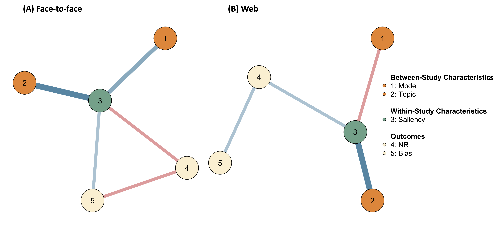
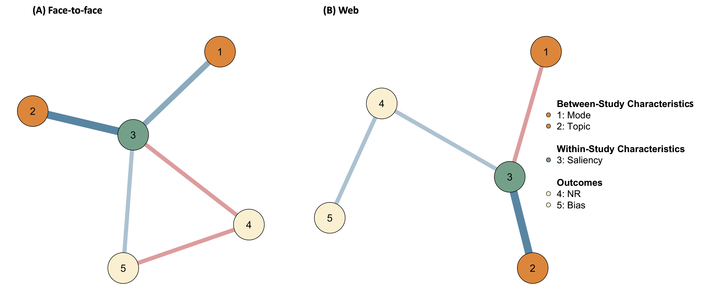

```{r setup, include=FALSE}
library(tinytex)
knitr::opts_chunk$set(
    echo = FALSE,
    message = FALSE,
    warning = FALSE
)
options(tinytex.verbose = TRUE)

library(dplyr)
library(kableExtra)
```

```{=tex}
\allsectionsfont{\raggedright}
\subsectionfont{\raggedright}
\subsubsectionfont{\raggedright}
```
\pagenumbering{gobble}

````{=tex}
\begin{centering}

\vspace{3cm}

\vspace{1cm}

\Large
{\bf Utrecht University}

\Large
{\bf Faculty of Social and Behavioural Sciences}

\vspace{1cm}

\Large

\doublespacing
{\bf Network Analysis: A novel approach to the problem of nonresponse bias}

\vspace{1 cm}

\normalsize
\singlespacing
By

\vspace{0.5 cm}

\Large

{\bf SHANNON DICKSON}

\vspace{1.5 cm}

\Large
{\bf Methodology and Statistics for the Behavioural, Biomedical, and Social Sciences}

\vspace{1.5 cm}

\normalsize

Supervisors: \\
Dr Peter Lugtig \\
Dr Bella Struminskaya

\vspace{0.5cm}
Word count: 2409/2500

FETC Ethics Application Number: 22-2063

Student ID: 6369693

Target journal: Journal of Survey Statistics and Methodology

\end{centering}
````

\newpage

\pagenumbering{gobble}

\spacing{1.5}


# Introduction

\ \ \ Survey research is confronted with two paradoxical trends: Response rates are declining while estimates of nonresponse bias are stable [@lippsAttritionHouseholdsIndividuals2009; @andreskiResponseRatesNational2012; @schoeniResponseRatesNational2013; @czajkaDecliningResponseRates2016; @beullensResponseRatesEuropean2018]. Nonresponse is one possible source of error in surveys and occurs when not all the sampled units respond. Immediate consequences of nonresponse include loss of precision due to reduced sample sizes and increased survey costs to boost responses. Nonresponse can also weaken the integrity of the data due to nonresponse bias. Since it would be unreasonable to expect all intended units to respond to our surveys, nonresponse is an inescapable fact of this kind of research. Rising nonresponse is well observed [@brickExplainingRisingNonresponse2013]. Nonresponse occurs for a variety of reasons of which some are situation specific. Face-to-face surveys attempt to contact potential respondents at home but may catch them at an inconvenient time or they might be unwilling to participate. Mail surveys may not reach the intended recipient due to an incorrect (email) address. Web surveys often fail to capture certain demographics such as older and/or rural recipients. Aside from the mode of the survey there are many more potential contributors to nonresponse. Survey length, purpose/saliency, incentivisation, source of sampling frame, and the type of question or statistic estimated and interactions between these variables may all contribute to nonresponse and increase the chance of bias. Prior investigations did not find convincing associations between these factors and survey nonresponse or nonresponse bias [@grovesImpactNonresponseRates2008] but a more recent meta-analysis found a negative association between nonresponse and bias [@cornesseThereAssociationSurvey2018].  Still, only a small magnitude of bias is detected across a range of surveys in health [@gundgaardEffectNonresponseEstimates2007], consumer research [@curtinEffectsResponseRate2000], opinion polls [@keeterConsequencesReducingNonresponse2000], and even simulations [@beullensShouldHighResponse2012]. Interestingly, refusal to respond is the most commonly reported reason for high nonresponse across Western surveys [@brickExplainingRisingNonresponse2013]. This is promising if we believe that a potential respondent’s willingness can be changed or manipulated by changing the survey environment. Immense effort is given to improving response rates [@sakshaugReducingNonresponseData2022] by increasing the contact attempts [@beebeTestingImpactMixed2018], offering renumeration [@lippsEffectsDifferentIncentives2010; @mcgonagleEffectsIncentiveBoost2020], or defining the “hard-to-reach” for targeted follow-ups [@southernSamplingHardtoreachPopulations2008]. Increasing effort is motivated by the belief that improving response rates reduces nonresponse bias. Empirically, it seems that the costs associated with these efforts is rarely justified by actual reductions in bias [@peytchevNotAllSurvey2009]. 
\
\ \ \ Should we abandon the response rate as an indicator of survey quality? We believe the extant literature does not offer enough evidence to conclusively answer this question. @grovesImpactNonresponseRates2008's landmark study shows almost no relationship between nonresponse and nonresponse bias. Across 959 estimates pooled from 59 studies, there is only a weak correlation of around .20 and they conclude that a single indicator of survey quality such as response rates is misleading. Unfortunately, the veracity of their conclusion is undermined by a relatively small sample size that consequently limits them to univariate analyses. They claim further that most variation in bias occurs within-study without offering analysis of between-study variation. Actually, when @brickResponsiveSurveyDesigns2017 re-analysed the data from @grovesImpactNonresponseRates2008 they found a correlation of .49 between nonresponse and bias when the correlation is weighted by sample size. Another limitation of @grovesImpactNonresponseRates2008 is that nonresponse is deemed a *cause* of nonresponse bias. Yet there is a disconnect between their causal theories of nonresponse bias and how the data is meta-analysed, as univariate analysis cannot capture complex interactions among survey characteristics).
\
\ \ \ Our study is unique in several aspects: (1) A greater sample size of empirical studies than previous studies; (2) More unique survey characteristics coded than previous studies; (3) Increased statistical power; and (4) a first application of network models that have a clearer link to causal theories. We consider how several survey characteristics influence nonresponse and bias and if these characteristics reveal how they are linked.

# Background

## Nonresponse Bias

\ \ \ Bias in an unadjusted mean or proportion is decided by the average response propensity and the correlation between individual response propensities and the variable of interest. 
\
\ \ \ Taking @bethlehemSelectionBiasWeb2010 ‘s definition of nonresponse bias, we have:

$$
NR_{bias}(\bar{y}_r) = \frac{\sigma_{p_i,\mu_i}}{\bar{P}}, \tag{1}
$$ 
\
where $\bar{y}_r$ is the value of the outcome variable, $\sigma_{p_i,\mu_i}$ is the covariance of the outcome variable and individual response propensity, and $\bar{P}$ is overall response propensity. 
\
\ \ \ @bethlehemSelectionBiasWeb2010‘s definition highlights the theoretical simplicity of how nonresponse and bias are related. If respondents and nonrespondents are homogenous with respect to the outcome bias is low. If they are heterogenous bias is high. This quantifies nonresponse bias as a predominantly within-study phenomenon. Leverage-saliency [@grovesImpactNonresponseRates2008; @grovesNonresponseRatesNonresponse2006; @grovesExperimentsProducingNonresponse2006] and response-propensity theory [@brickResponsiveSurveyDesigns2017] explain how between-study variation is also a factor.

### Connecting Nonresponse to Nonresponse Bias

\ \ \ According to leverage-saliency theory, both individual differences and survey content affect participation. Some are motivated to respond to shorter surveys while others are motivated by the topic. Motivating factors increase the saliency of the survey and may have high leverage on the participation decision. If these factors are associated with the outcome variable, statistics calculate on it are biased.
\
\ \ \ A scenario under response-propensity theory known as *correlated propensities model* also produces nonresponse bias [@brickResponsiveSurveyDesigns2017]. If response propensities correlate with survey design features and individual characteristics of the respondents, certain groups become overrespresented and outcomes are biased to them [^1].

[^1]: See @brickResponsiveSurveyDesigns2017 for details on all scenarios under response-propensity theory.

### Connecting Theories to Causal Mechanisms 

\ \ \ Leverage-saliency and response-propensity theory posit that nonresponse and nonresponse bias arise from interaction of within- and between-study factors. **Figure 1** displays three causal models for these theories [@grovesImpactNonresponseRates2008; @grovesExperimentsProducingNonresponse2006, @grovesNonresponseRatesNonresponse2006]. 
\
\ \ \ Response propensity, $P$, and the outcome, $Y$ can have *separate causes*, $Z$ and $X$ respectively (**A**); a *common cause*, $Z$ (**B**); or a *survey variable cause* of response propensity, $Y$ (**C**). Common causes and survey variable causes both produce nonzero covariance matrices for bias, eliciting indirect and direct effects.

```{r cause model, echo = FALSE, out.width ="70%", fig.cap ="Causal models for nonresponse bias in surveys. ", fig.align='center'}

``` 

### The Need for Nonresponse Analysis and A New Approach: Network Models

\ \ \ Declining response rates care a concern for survey researchers, who fear an accompanied rise in nonresponse bias. Yet previous studies fail to find this effect [@grovesImpactNonresponseRates2008; @grovesExperimentsProducingNonresponse2006; @hedlinThereSafeArea2020; @beullensShouldHighResponse2012; @gundgaardEffectNonresponseEstimates2007]. Nonresponse analysis is generally not well reported; just 30% reported it in one meta-analysis [@wernerReportingNonresponseAnalyses2007]. This, together with the limitations of prior reports, indicate that we lack a full view on whether nonresponse leads to nonresponse bias. Traditional methods like multilevel regression or correlations don't have a clear link to the causal models in **Figure 1**. 
\
\ \ \ In other fields, statistical network models are used to substantiate causal frameworks [^2]. Networks visualize statistical conditional relations of many variables in a succinct and more informative way than regression can, identifying *potential* causal pathways and predictive relationships [@ryanChallengeGeneratingCausal2022; @epskampGaussianGraphicalModel2018]. Assuming that the data generating process of nonresponse bias follows @bethlehemSelectionBiasWeb2010‘s formula, we can estimate a network structure involving survey characteristics and the covariation to nonresponse and nonresponse bias. **Figure 2** illustrates this for survey topic and saliency in separate modes. Interviewers in face-to-face surveys can increase saliency by explicitly relating the topic to the individual, increasing response rates and reducing bias (**A**). There is no opportunity to increase saliency like this in web surveys, so responses decline and bias increases (**B**). Expanding these examples to involve more survey characteristics will show us what common or survey causes affect response propensity and bias.

```{r network model, echo = FALSE, out.width="100%", fig.cap ="Example of how a network model could differ in face-to-face and web survey modes. Blue edges indicate positve edges and pink edges indicate negative edges.", fig.align='center'}

```

[^2]: Network models can only be considered explicitly as causal models be considered under strict circumstances [see @ryanChallengeGeneratingCausal2022].

# Method

## Aim

\ \ \ We aim to use statistical networks to describe the conditional relations between nonresponse and nonresponse bias, accounting for survey design. We initially conducted a systematic meta-analysis of literature reporting nonresponse and nonresponse bias in surveys. As it stands, this is the first application of a network approach to nonresponse analysis. Our results will hopefully inform survey designers who wish to minimize nonresponse bias. 

## Systematic Meta-Analysis

### Eligibility Criteria and Search Strategy

\ \ \ Our search strategy was based on the strategy used in the original review by @grovesImpactNonresponseRates2008. A list of key search terms was taken from @grovesImpactNonresponseRates2008 and expanded to include all relevant key words related to nonresponse rates and nonresponse bias. Some examples of these terms include "response bias", "nonresponse bias", "selection bias", "survey bias", and "participation rates". Articles were primarily identified from five electronic databases (Google Scholar, Web of Science, Scopus, Web Survey Methodology, and PsychInfo) in 2021. Searches of conference proceedings (e.g., American Statistical Association Survey Research Methods Section), articles cited in book chapters (e.g., the Wiley Series in Survey Methodology), and internet Google searches using the key search terms were also conducted to capture a wider range of articles and grey literature. Eligible articles met these criteria:
\
1. The study is empirical and about nonresponse rates
2. A probability-sample is drawn from a population
3. A survey is conducted
4. Sample frame information is collected on respondents and nonrespondents. 
\
\ \ \ Articles originating from @grovesImpactNonresponseRates2008 were automatically included. Panel studies were excluded in addition to articles that did not mention nonresponse rates and nonresponse bias. All articles were published between 1978 and 2020.

### Screening phase

\ \ \ ASReview (v0.19.1) [@vandeschootOpenSourceMachine2021] screened the literature from the initial search. A random sample of articles was coded as relevant or irrelevant by five independent coders. Coded articles served as training input to the ASReview which classified the remaining literature. ASReview results were divided across the coders who manually screened article abstracts or full-texts for quality until 25 consecutive articles were coded irrelevant. Articles incorrectly classified as irrelevant by ASReview were corrected before coding, resulting in 113 articles and 3301 estimates.

### Coding phase

\ \ \ 113 studies were divided across five independent coders instructed to record all relevant characteristics of the study. Discrepancies were resolved by discussion [^3]. See Appendix: Table 1 for an overview.

[^3]: Kappa's Fleiss coefficient will be calculated when coding is complete to ensure interrator reliability.

### Calculation of nonresponse rate

\ \ \ Nonresponse rate is defined as a percentage of all the potentially eligible units that do not respond to the items in a survey. Unit nonresponse rates were calculated in our study, where all data from a sampled respondent are missing.
\
\ \ \ Response rate is calculated as:

$$
RR = 100*\frac{n_R}{n_E}, \tag{2}
$$ 
\
where $n_R$ is the number of eligible units in the responding sample and $n_E$ is the total number of eligible units invited to respond. 

### Calculation of nonresponse bias

\ \ \ Nonresponse bias consists of two components: nonresponse rates and the difference between respondents and nonrespondents on an estimate. We calculate the absolute relative bias in the same manner as @grovesImpactNonresponseRates2008:

$$
Bias (\hat{y}_r) =  \left\lvert\frac{100*(\hat{y_r} - \hat{y_n})}{\bar{y_n}}\right\rvert, \tag{3}
$$ 
\
where $\hat{y_r}$ is the survey estimate for respondents, $\hat{y_n}$ is the survey estimate for nonrespondents, and $p_n$ is the nonresponse rate.

## Network Analysis

\ \ \ Network models are families of probability distributions that satisfy several conditional (in)-dependency statements represented in an undirected graph [@haslbeckStructureEstimationMixed2015]. An undirected graph $G = (V, E)$ consists of nodes $\mathit{V = \{1, 2,..., p\}}$ and edges $\mathit{E \subseteq V * V}$. Nodes represent variables (survey characteristics) and edges connecting nodes represent statistical relations.

### Mixed Graphical Models

\ \ \ Mixed Graphical Models (MGMs; [@haslbeckStructureEstimationMixed2015; @chenSelectionEstimationMixed2015; @yangMixedGraphicalModels2014]) are probabilistic graphical models reflecting the joint probability density of multiple variables that follow different distributions. Each node is therefore associated with a different conditional exponential family distribution. Specifically, the pairwise interaction between two continuous variables, $\mathit{s}$ and $\mathit{r}$, is given by a single parameter, $\theta_{s,r}$. $\theta_{s,r}$ represents if the interaction is non-zero. Pairwise interactions between two categorical variables, $\mathit{m}$ and $\mathit{u}$ are given by $\mathit{R = (m-1)*(u-1)}$ parameters associated with corresponding indicator functions (dummy variables) associated with $\mathit{R}$ states. Pairwise interactions between a continuous and a categorical variable is given by $\mathit{R = 1*(m-1)}$ parameters associated with $\mathit{(m-1)}$ corresponding indicator functions for all $\mathit{R}$ states [@haslbeckMgmEstimatingTimeVarying2020]. 

\ \ \ MGMs are constructed by factoring $\mathit{n}$ univariate conditional members of the exponential family to a joint distribution [^4] :

$$
\mathit{P_{PL}(\textbf{Y = y}) = \prod_{i=1}^n P(Y_{i}|\textbf{Y}_{\backslash i})} \tag{4}
$$ 

where $n$ is the number of nodes and $\textbf{Y}_{\backslash i}$ is the set of nodes without node $i$. 

[^4]: Factorization only leads to well-defined joint probability distributions under certain conditions (see @chenSelectionEstimationMixed2015). 

\ \ \ There are two steps in estimating the parameters for the MGM. First, the conditional distribution of each node is estimated separately using generalized linear regression. Since estimation is univariate, there are two estimates for each node. Both estimates are averaged in a second step into one network structure. We will specify an *"AND"* rule to retain only edges where both estimates are non-zero. A regularization parameter to prevent overfitting will be selected by the Extended Bayesian Information Criterion (EBIC):

$$
EBIC = -2LL(\hat{\theta}) + J log(n)+2\gamma J log(p-1), \tag{5}
$$ 

\
where $LL(\hat{\theta}$ is the log likelihood of the model, $J$ is the number of parameters, $p$ is the number of variables, and $\gamma$ is the hyperparameter weighting the extra penalty $2Jlog(p-1)$.

\ \ \ A different network will be estimated for each survey mode. Bootstrapping can estimated the accuracy of the edge-weights and test for differences between them through a bootstrapped difference test [@epskampEstimatingPsychologicalNetworks2018]. 

**Software**

\ \ \ All analysis is conducted using R version 4.1.2. Estimation is implemented in the  `mgm` package [@haslbeckMgmEstimatingTimeVarying2020], network visualization by the `qgraph` package [@epskampQgraphNetworkVisualizations2012], and bootstrapping by the `bootnet` package [@epskampEstimatingPsychologicalNetworks2018].

# Results

## Descriptive Analysis

**Figure 3** and **Figure 4** show the weighted correlation between nonresponse rates and nonresponse bias overall (top) and between-study means (bottom). Studies originally included by @grovesImpactNonresponseRates2008 are distinguished by the orange points. New studies included in our analysis are the green points. A linear regression line is fitted for the studies by @grovesImpactNonresponseRates2008 separately from the new studies. The overall weighted correlation is $R_{wtd} = 0.20$ for the old studies and $R_{wtd} = 0.23$ for the new studies. Our analysis of the between-study correlation of nonresponse rates with the mean nonresponse bias found  $R_{wtd} = 0.47$ and $R_{wtd} = 0.40$ in the olde and new studies, respectively. 

```{r, echo = FALSE, out.width="100%", fig.cap ="Correlation of nonresponse rates and nonresponse bias.", fig.align='center'}
knitr::include_graphics("../analysis/plot1.png")
```

```{r, echo = FALSE, out.width="100%", fig.cap ="Between-Study correlation of nonresponse rates and nonresponse bias.", fig.align='center'}
knitr::include_graphics("../analysis/p2.2_between.png")
```

**Table 1** displays the mean absolute relative bias, response rates, and sample size of the coded survey characteristics. Notably, the absolute relative bias is lowest in the mode with the highest response rate (face-to-face) and more in the modes with lower response rates (i.e.paper drop and web).

```{r, options(knitr.kable.NA = ''), echo=FALSE}
t1_desc <- readr::read_csv("../analysis/t1_desc.csv")

t1_desc %>% 
  kbl(digits = c(0, 2, 2),
      format = "latex",
      align = "l",
      booktabs = TRUE,
      linesep = "",
      caption = "Absolute Relative Bias and Nonresponse Rates across Survey Characteristcs") %>% 
  kable_classic(position = "left",
                latex_options = c("repeat_header","scale_down", "HOLD_position"), repeat_header_text = "(cont.)",
                full_width = TRUE) %>% 
  pack_rows("Mode", 1, 6) %>% 
  pack_rows("Topic", 7, 21) %>% 
  pack_rows("Saliency",22, 24) %>% 
  pack_rows("Incentives", 25, 28) %>% 
  pack_rows("Reminders", 29, 32) %>% 
  pack_rows("Statistic", 33, 37) %>% 
  pack_rows("Source", 38, 43) %>% 
  pack_rows("Groves", 44, 45) %>% 
  pack_rows("Question", 46, 49) %>% 
  pack_rows("Urbanicity", 50, 53) %>% 
  pack_rows("Population", 54, 68) %>%
  row_spec(0, bold = TRUE)
```

\newpage

# References

<div id="refs"></div>

\newpage

# Appendix

```{r appendix, echo=FALSE}
# Create table
Variable <- c("N. Questions", "Reminders", "Gender", "Prenotification", "Source", "Max NC attempts", "Populaton Type", "Sponsorship", "Incentives", "Mode", "Statistic type", "Year", "Topic", "Topic Saliency", "Question type")
Description <- c("Indicates the number of questions as an measure of survey length",
          "Indicates if the respondents received a reminder to participate (Yes/No)",
          "Indicates the gender of the respondent (male/female)",
          "Indicates if the the targeted population are notified about the survey prior to receiving it",
          "Indicates the source of the information on nonrespondents (sample frame, supplemental information, screener, intention to respond)",
          "Indicates the number of attempts made to contact members of the target population who remained uncontactable",
          "Indicates if the population is special (pre-specified) or not (yes/no)",
          "Indicates If the survey is sponsorship by a third party (yes/no)",
          "Indicates If the respondents are offered an incentive for participating",
          "Indicates the mode of the Survey (face-to-face, telephone, (e)mail, web)",
          "Indicates if the outcome of interest is a mean, proportion, total, or median",
          "Indicates the year the corresponding article was published",
          "Indicates the topic of the survey topic (collapsed to health/other)",
          "Indicates If the topic is saliency to the respondent (yes/no)",
          "Indicates if the question is about demographics, is observable, or is unobservable")

data.frame(Variable, Description) %>% 
  kbl(
    format = "latex",
    align = "l",
    booktabs = TRUE,
    linesep = "",
    caption = "Overview of the survey characteristics coded in the meta-analysis"
    ) %>% 
  kableExtra::kable_styling(
    position = "left",
    latex_options = c("repeat_header","scale_down", "HOLD_position"),
    full_width = TRUE
    )
```

