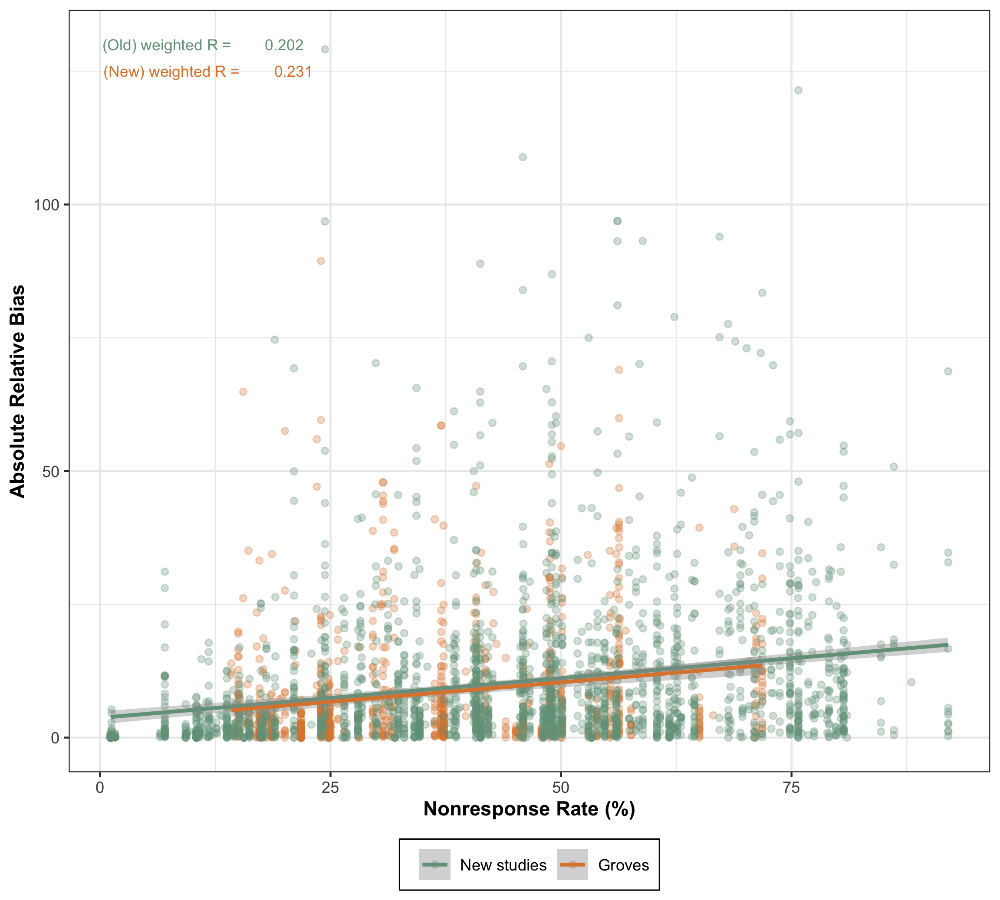
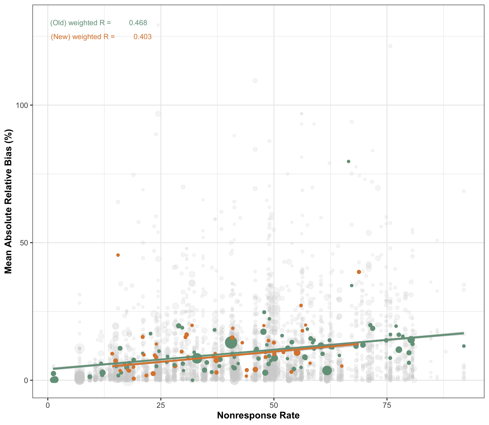
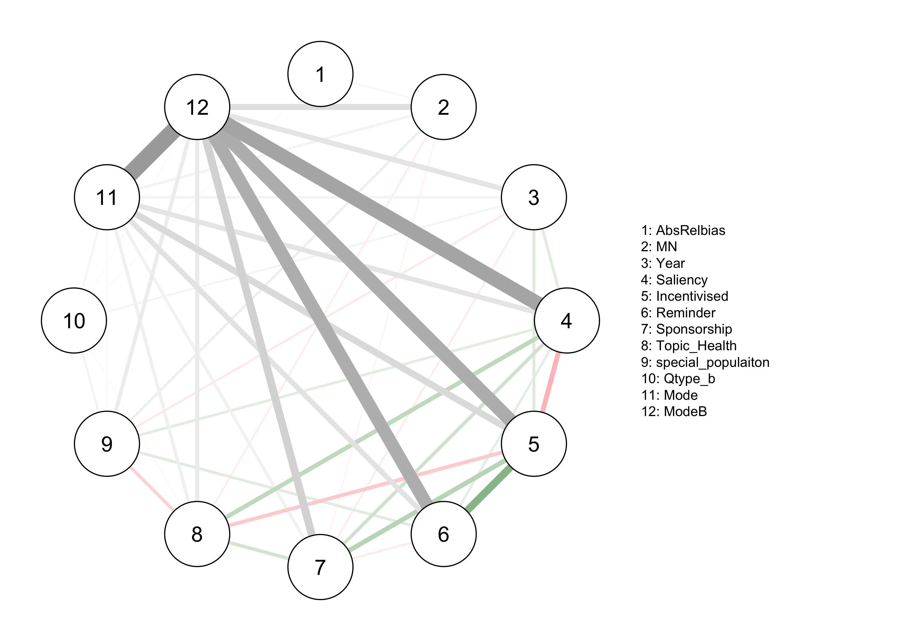
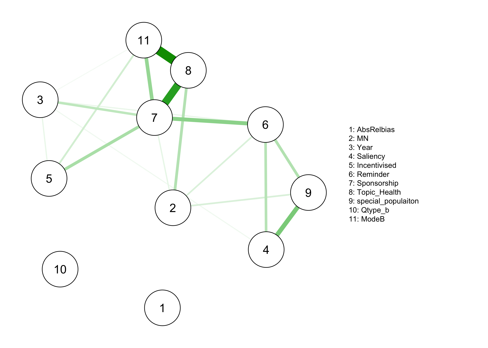
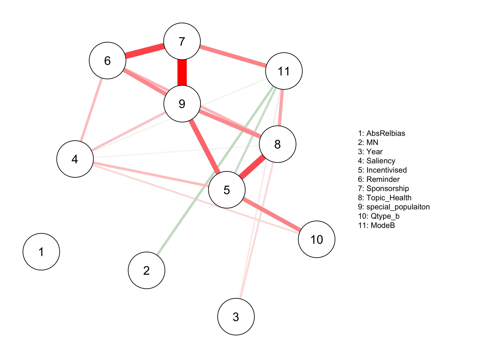
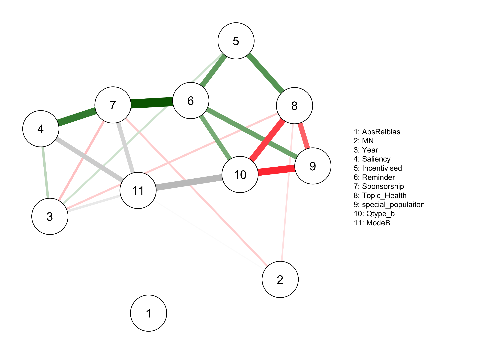

```{r setup, include=FALSE}
library(tinytex)
knitr::opts_chunk$set(
    echo = FALSE,
    message = FALSE,
    warning = FALSE
)
options(tinytex.verbose = TRUE)

library(dplyr)
library(kableExtra)
```

```{=tex}
\allsectionsfont{\raggedright}
\subsectionfont{\raggedright}
\subsubsectionfont{\raggedright}
```
\pagenumbering{gobble}

````{=tex}
\begin{centering}

\vspace{3cm}

\vspace{1cm}

\Large
{\bf Utrecht University}

\Large
{\bf Faculty of Social and Behavioural Sciences}

\vspace{1cm}

\Large

\doublespacing
{\bf Network Analysis: A novel approach to the problem of nonresponse bias}

\vspace{1 cm}

\normalsize
\singlespacing
By

\vspace{0.5 cm}

\Large

{\bf SHANNON DICKSON}

\vspace{1.5 cm}

\Large
{\bf Methodology and Statistics for the Behavioural, Biomedical, and Social Sciences}

\vspace{1.5 cm}

\normalsize

Supervisors: \\
Dr Peter Lugtig \\
Dr Bella Struminskaya

\vspace{0.5cm}
Word count: 2409/2500

FETC Ethics Application Number: 22-2063

Student ID: 6369693

Target journal: Journal of Survey Statistics and Methodology

\end{centering}
````

\newpage

\pagenumbering{gobble}

\spacing{1.5}
# Introduction

Survey responses have seen consistent decline over the last few decades. An implication of declining response rates is the increased potential for survey errors. Nonresponse bias occurs when the sampled units differ systematically from the non-sampled units [@bethlehemHandbookNonresponseHousehold2011]. A small sample size due to nonresponse also leads to a loss in statistical power and thus precision in estimates [@lohrSamplingDesignAnalysis2021]. In response to these consequences, survey researchers have mobilised efforts in boosting response rates by increasing fieldwork, advertising, and carefully selecting survey design characteristics to encourage responses [@sakshaugReducingNonresponseData2022; @mcgonagleEffectsIncentiveBoost2020; @beebeTestingImpactMixed2018; @lippsEffectsDifferentIncentives2010; @southernSamplingHardtoreachPopulations2008]. Likewise, many researchers are moving away from traditional probability based sampling procedures towards lower cost, nonprobability surveys that can be fielded more rapidly and yield higher response rates - but at the cost of accurate estimates [@cornesseReviewConceptualApproaches2020]. Response rates are readily used as indicators of survey quality in cross-sectional surveys [@andreskiResponseRatesNational2012] and longitudinal panel surveys [@kernLongitudinalFrameworkPredicting2019] despite underwhelming or contradicting evidence of its relation to bias [@kochAssessingESSSample2014; @leeExploringNonresponseBias2009; @grovesImpactNonresponseRates2008; @grovesNonresponseRatesNonresponse2006; @grovesExperimentsProducingNonresponse2006] and calls for new indicators of representatives [@kreuterFacingNonresponseChallenge2013; @bethlehemIndicatorsRepresentativenessSurvey]. Extensive literature addresses the issue of nonresponse, highlighting that the belief it is important for controlling bias continues to be persistent among practitioners. This may be due to the insistence of organisations like AAPOR that practitioners should "maximising the number of people who respond to your survey" through use of incentives, multiple contact attempts, and refusal conversion [@aaporBestPracticesSurvey2022].

Given the paradox that rising nonresponse does not always go in-hand with rising nonresponse bias, a key question facing researchers is if maximising response rates at significant financial cost is really worth it. Our study brings together information from 113 different studies on survey nonresponse and nonresponse bias, to investigate if there is a direct or indirect association between response rates and bias controlling for several survey design characteristics. Our analysis is guided by the prior work of @grovesNonresponseRatesNonresponse2006 and we aim to validate and extend their findings using a causal inference approach. Additionally, we hope to identify a set of survey characteristics that are indicative of nonresponse and nonresponse bias, so that practitioners can choose carefully how to design and field their surveys and what aspects of a survey to control for. 

# Background

## Nonresponse Rates and Nonresponse Bias

The Total Survey Error (TSE) framework identifies nonresponse and noncoverage as the major contributors to selection bias in surveys. Our primary concern is with nonresponse, which is when units that have been selected do not complete the survey. Bias occurs when the nonresponding units differ systematically from the responding units with respect to the outcome of interest. Many methods of calculating nonresponse bias exist, but the most commonly referred to is the formula from @bethlehemSelectionBiasWeb2010 given below. 

\begin{align}
NR_{bias}(\bar{y}_r) &= \frac{\sigma_{p_i,\mu_i}}{\bar{P}} \\
&\textrm{} \\
&\; \textrm{where}, \\
&\textrm{} \\
\bar{y}_r &= \textrm{the value of the survey outcome}, \\
&\textrm{} \\
\sigma_{p_i,\mu_i} &= \textrm{the covariance of the individual survey outcome and individual response prepensity},\\
&\textrm{} \\
\bar{P} &= \textrm{overall response propensity}\\
\end{align}

An attractive quality of this formulation of nonresponse bias is the theoretical simplicity with which it relates response rates and bias. The smaller the covariance between the outcome of interest and the propensity to response the smaller the bias. Empirically, it has proven very difficult to find instances where nonresponse and nonresponse bias are clearly linked. The most extensive study on the matter is the meta-analysis of @grovesImpactNonresponseRates2008 They considered 59 international studies that produced 959 estimates of nonresponse bias for population means or proportions, finding a weak positive correlation of 0.20 that led them to conclude that relying on single indicator of nonresponse bias - in this case nonresponse rates - is of limited use. Rather, @grovesImpactNonresponseRates2008 use leverage-saliency theory explain why a covariance between nonresponse and bias might exist. Leverage-saliency theory states that the interaction of within- and between-survey variables can impact response rates. For instance, the saliency of a survey to an individual unit is a within-survey characteristic that can increase their likelihood of responding when a between-survey characteristic, such as the topic, is highly salient or not responding when it is not so salient. The survey outcome becomes biased because these survey characteristics are associated with the outcome *and* alter the chances of responding.

Similarly, response-propensity theory put forward by @brickResponsiveSurveyDesigns2017 states that outcomes are biased when response propensities correlate with survey design and characteristics of the sample such that certain groups are overrepresented. For example, the mode of a survey can determine an individual's ability to respond: Online surveys are only available to people who have internet access and certain demographic groups have a limited online presence, such as older people or those on a low income. If this is the case for a particular survey, we would expect an interaction of mode and age or income to affect the propensity to respond and result in overrepresentation of young people or higher earners. 

The study by @grovesImpactNonresponseRates2008 is often cited as the "landmark" study on the relation between nonresponse and bias. It builds upon a prior meta-analysis that similarly found response rates to be poor indicators of nonresponse bias [@grovesNonresponseRatesNonresponse2006]. Further, the authors conclude that survey-level characteristics such as mode, incentives, and sponsorship, are also poor candidates in producing covariance between response propensities and the survey outcome [@grovesExperimentsProducingNonresponse2006]. Since their work, there has been little effort to investigate the matter further across multiple surveys. In fact, when @tourangeauSensitiveTopicsReluctant2010 re-analysed the data made available by Groves and Peytcheva they found a stronger correlation between nonresponse and bias of 0.49 when the correlation is weighted by the sample size of the study. The original study of Groves and Peytcheva bears more limitations, specifically a too low sample size to conduct extensive multivariate analyses of between-study effects (despite making claims these do not exist). This is an important limitation considering the nature of theories like leverage-saliency and response-propensity necessitate a deeper delve into covariance structures. The limitations and heterogeneity of current empirical findings is hindering the possibility of reaching consensus on the issue.

## Causal Mechanisms of Nonresponse Bias

In Figure 1, three causal mechanisms for the association between nonresponse and bias are presented. In each of the causal graphs $P$ represents the propensity to response, $Y$ represents the estimated survey outcome, $Z$ and $X$ are independent causes of survey outcomes and response propensities. On the left, $P$ and $Y$ have separate causes, $Z$ and $X$, that in causal terms means they are d-separated. D-separation implies that because $P \perp\!\!\!\!\perp Y$ the estimated survey outcome is equivalent to the population value of that outcome, $P(Y|P)=P(Y)$. Under the separate cause scenario, unit nonresponse and the differences between respondents and nonrespondents is *ignorable.* In the center, $Y$ is a cause of $P$ meaning that $P\!\perp \! \! \! \!\perp Y$ is not true, leading to *non-ignorable* unit nonresponse, as differences between respondents and nonrespondents are more probable. On the right, $P$ and $Y$ have a common cause, $Z$, which induces a correlation between $P$ and $Y$ that does not exist independently of $Z$. If $Z$ is a known property of the survey then conditioning on it gives us $P \perp\!\!\!\!\perp Y|Z$ and $P(Y|Z,P)=P(Y|Z)$. As a result, the spurious path between $Y$ and $P$ is blocked. Conversely, if $Z$ is not a known property of the survey it is an unmeasured confounder and d-separation of $Y$ and $P$ is not possible. For example, a health survey that wants to estimate healthcare costs for the general population will underestimate the total cost if the nonresponse is primarily due to illness [@gundgaardEffectNonresponseEstimates2007]. Illness prevents people from responding and is directly related to the survey outcome. Adjusting the estimated healthcare costs (e.g., through weighting) is only possible if the survey has a question that distinguishes healthy and unhealthy respondents.

```{r, echo = FALSE, out.width ="70%", fig.cap ="Three causal graphs, adapted from Groves (2006). P is the latent response propensity and Y is the survey outcome. Z and X indicate separate potential causes for P and Y. Nonresponse bias occurs when P and Y are correlated (centre and right).", fig.align='center'}
knitr::include_graphics("img/dags_groves.png")
``` 

Figure 2 presents an extension of the graph corresponding to the center scenario presented in Figure 1. Here, the survey outcome, $Y$, and a second independent survey variable, $X$, both influence the propensity to respond, $P$. In the causal literature this is called a collider structure which cause collider bias. This is an important extension to the scenario presented by @grovesNonresponseRatesNonresponse2006 because in the context of a survey it leads to in-sample correlations that *do not* exist in the population. Consider a health survey that wants to determine how many people are smokers (yes/no). This survey also collects information on sex (male/female). The survey outcome (smoking status) affects the propensity to respond because it is socially undesirable to identify as a smoker, therefore smokers are underrepresented. Surveys often also have more responses from women than men, so women are overrepresented. If we wish to know how smoking status, $Y$, varies across women and men, $X$, we are forced to condition on $P$ which induces a spurious correlation between being a smoker and being a women. The nonresponse bias in the survey therefore leads to conclusions that may be invalid (e.g., women are more likely to be smokers).
 
```{r, echo = FALSE, out.width ="25%", fig.cap ="Extension of the survey variable cause graph.", fig.align='center'}
knitr::include_graphics("img/dags_extended.png")
```

## A Graphical Approch to Nonresponse Bias: Network Analysis

The concept of using causal (graphical) models to aid more valid survey inference is not new. The causal mechanisms in Figure 1 are adapted from Groves and Peytcheva [-@grovesExperimentsProducingNonresponse2006; @grovesImpactNonresponseRates2008] and more recent multilevel models have attempted some causal reasoning [@rybakSurveyModeNonresponse2023]. Network models estimate a set of conditional (in)-dependencies among many different variables, giving some indication of *potential* causal and predictive relationships [@ryanChallengeGeneratingCausal2022; @epskampGaussianGraphicalModel2018]. In this study, we explore the extent of the utility of network modelling in constructing a causal framework for the impact of nonresponse and survey characteristics on nonresponse bias. Network models originate in the computer sciences but have seen recent applications in social and psychological sciences [@borsboomNetworkAnalysisMultivariate2021; @epskampGaussianGraphicalModel2018; @epskampQgraphNetworkVisualizations2012].

The current climate of declining response rates in surveys seems set to continue. Practitioners and organisations are allocating a considerable amount of funding to stem the loss of information due to nonresponse. Consider the European Social Survey (ESS), which has an extensive fieldwork period of six weeks over the course of five months. Fieldwork efforts have also increased over the ESS waves, meaning more contact attempts, conversion of refusals, use of prenotification and offering incentives [@beullensResponseRatesEuropean2018]. Despite this, response rates diminish year on year and only a weak correlation with differences between respondents and non-respondents is found [@kochAssessingESSSample2014]. Indeed, the stability of nonresponse bias in the presence of declining response rates is a common finding in the literature [@lippsAttritionHouseholdsIndividuals2009; @andreskiResponseRatesNational2012; @schoeniResponseRatesNational2013; @czajkaDecliningResponseRates2016; @beullensResponseRatesEuropean2018]. In their simulation study, @beullensShouldHighResponse2012 investigated different strategies for reducing the risk of nonresponse bias and found that maximising response rates alone yielded the highest risk for bias, with a response rate of 55% and a 49% risk for bias. Nonresponse bias is difficult to overcome by increasing response rates alone, necessitating extensive nonresponse analysis to uncover the complex mechanisms underlying bias. 

# Method

## Aim

We aim to use statistical networks to describe the conditional relations between nonresponse and nonresponse bias, accounting for survey design. We initially conducted a systematic meta-analysis of literature reporting nonresponse and nonresponse bias in surveys. As it stands, this is the first application of a network approach to nonresponse analysis. Our results will hopefully inform survey designers who wish to minimize nonresponse bias. 

## Systematic Meta-Analysis

### Eligibility Criteria and Search Strategy

Our search strategy was based on the strategy used in the original review by @grovesImpactNonresponseRates2008. A list of key search terms was taken from @grovesImpactNonresponseRates2008 and expanded to include all relevant key words related to nonresponse rates and nonresponse bias. Some examples of these terms include "response bias", "nonresponse bias", "selection bias", "survey bias", and "participation rates". Articles were primarily identified from five electronic databases (Google Scholar, Web of Science, Scopus, Web Survey Methodology, and PsychInfo) in 2021. Searches of conference proceedings (e.g., American Statistical Association Survey Research Methods Section), articles cited in book chapters (e.g., the Wiley Series in Survey Methodology), and internet Google searches using the key search terms were also conducted to capture a wider range of articles and grey literature. Eligible articles met these criteria:

\begin{enumerate}
    \item The study is empirical and about nonresponse rates
    \item A probability-sample is drawn from a population
    \item A survey is conducted
    \item Sample frame information is collected on respondents and nonrespondents. 
\end{enumerate}

 Articles originating from @grovesImpactNonresponseRates2008 were automatically included. Panel studies were excluded in addition to articles that did not mention nonresponse rates and nonresponse bias. All articles were published between 1978 and 2020.


### Screening phase

 ASReview (v0.19.1) [@vandeschootOpenSourceMachine2021] screened the literature from the initial search. A random sample of articles was coded as relevant or irrelevant by five independent coders. Coded articles served as training input to the ASReview which classified the remaining literature. ASReview results were divided across the coders who manually screened article abstracts or full-texts for quality until 25 consecutive articles were coded irrelevant. Articles incorrectly classified as irrelevant by ASReview were corrected before coding, resulting in 113 articles and 3301 estimates.

### Coding phase

113 studies were divided across five independent coders instructed to record all relevant characteristics of the study. Discrepancies were resolved by discussion [^1]. See Appendix: Table 1 for an overview.

[^1]: Kappa's Fleiss coefficient will be calculated when coding is complete to ensure interrator reliability.

### Calculation of nonresponse rate

Nonresponse rate is defined as a percentage of all the potentially eligible units that do not respond to the items in a survey. Unit nonresponse rates were calculated in our study, where all data from a sampled respondent are missing.
\
Response rate is calculated as:


\begin{align*}
RR &= 100*\frac{n_R}{n_E} \\ 
\textrm{where}, \\
n_R &= \textrm{the number of eligible units in the responding sample}, \\
n_E &= \textrm{is the total number of eligible units invited to respond}. \\
\end{align*}


### Calculation of nonresponse bias

Nonresponse bias consists of two components: nonresponse rates and the difference between respondents and nonrespondents on an estimate. We calculate the absolute relative bias in the same manner as @grovesImpactNonresponseRates2008:


\begin{align*}
Bias(\hat{y}_r) &=  \left\lvert\frac{100*(\hat{y_r} - \hat{y_n})}{\bar{y_n}}\right\rvert \\ 
\textrm{where}, \\
\hat{y_r} &= \textrm{the survey estimate for respondents},  \\
\hat{y_n}  &= \textrm{the survey estimate for nonrespondents},  \\
p_n        &= \textrm{the nonresponse rate.}  \\
\end{align*}

## Network Analysis

Network models are families of probability distributions that satisfy several conditional (in)-dependency statements represented in an undirected graph [@haslbeckStructureEstimationMixed2015]. An undirected graph $G = (V, E)$ consists of nodes $\mathit{V = \{1, 2,..., p\}}$ and edges $\mathit{E \subseteq V * V}$. In our study, nodes represent survey design characteristics (e.g., mode, topic, saliency, nonresponse, bias) and edges connecting nodes represent statistical relations among them. Since we have data of mixed type (continuous, cateogrical) we opted to use mixed graphical modelling. 

### Mixed Graphical Models

Mixed Graphical Models (MGMs; [@haslbeckStructureEstimationMixed2015; @chenSelectionEstimationMixed2015; @yangMixedGraphicalModels2014]) are probabilistic graphical models reflecting the joint probability density of multiple variables that follow different distributions. Each node is therefore associated with a different conditional exponential family distribution. Specifically, the pairwise interaction between two continuous variables, $\mathit{s}$ and $\mathit{r}$, is given by a single parameter, $\theta_{s,r}$. $\theta_{s,r}$ represents if the interaction is non-zero. Pairwise interactions between two categorical variables, $\mathit{m}$ and $\mathit{u}$ are given by $\mathit{R = (m-1)*(u-1)}$ parameters associated with corresponding indicator functions (dummy variables) associated with $\mathit{R}$ states. Pairwise interactions between a continuous and a categorical variable is given by $\mathit{R = 1*(m-1)}$ parameters associated with $\mathit{(m-1)}$ corresponding indicator functions for all $\mathit{R}$ states [@haslbeckMgmEstimatingTimeVarying2020]

There are two steps in estimating the parameters for the MGM. First, the conditional distribution of each node is estimated separately using generalized linear regression. There are two estimates for each node that are averaged in a second step into one network structure. Edges represent the averaged nodewise regressions. In additional estimation steps, we specify an *"AND"* rule that only retains edges where both nodewise estimates are non-zero. The Extended Bayesian Information Criterion (EBIC) is selected as a regularization parameter to prevent overfitting.

**Software**

All analysis is conducted using R version 4.1.2. Estimation is implemented in the  `mgm` package [@haslbeckMgmEstimatingTimeVarying2020], network visualization by the `qgraph` package [@epskampQgraphNetworkVisualizations2012], and bootstrapping by the `bootnet` package [@epskampEstimatingPsychologicalNetworks2018]. Packages used for data manipulation are all from `tidyverse` and `kableExtra`.

# Results

## Descriptive Statistics

Table 1 compares the mean rate of nonresponse and nonresponse bias in the original studies from the meta-analysis by Groves and Peytcheva (2008) and the new studies from our literature search. Compared to the studies from their meta-analysis, nonresponse rates and nonresponse bias is higher in the newly found studies. 

```{r}
t1_groves <- readr::read_csv("../../analysis/tables/t1_groves.csv")

t1_groves %>% 
  kbl(col.names = c("Studies", "Nonresponse Rate", "Absolute Relative Bias"), 
      digits    = 2,
      align     = c("l", "c", "c"),
      booktabs  = T,
      linesep   = "",
      caption   = "NR and NRB in the current meta-analysis compared to an earlier meta-analysis") %>% 
  kable_classic(position      = "left",
                latex_options = "HOLD_position",
                full_width    = F) %>% 
  column_spec(c(1, 2, 3), width = "12em") %>% 
  column_spec(1, bold = T) %>% 
  row_spec(0, bold    = T) %>% 
  footnote(general    = "Nonresponse rate and absolute relative bias are expressed as a percentage.")
```


Table 2 shows mean rate of nonresponse and nonresponse bias in different modes for all studies included in our analysis. Web surveys have the highest rate of nonresponse and bias whereas face-to-face surveys have the lowest nonresponse rates and nonresponse bias. 


```{r}
t2_modes <- readr::read_csv("../../analysis/tables/t2_modes.csv")

t2_modes %>% 
  kbl(digits   = 2,
      align    = c("l", "c", "c"),
      booktabs = T,
      linesep  = "",
      caption  = "Nonresponse rates and absolute relative bias by survey mode") %>% 
  kable_classic(position      = "left",
                latex_options = "HOLD_position",
                full_width    = F) %>% 
  column_spec(c(1, 2, 3), width = "12em") %>% 
  column_spec(1, bold = T) %>% 
  row_spec(0, bold = T) %>% 
  footnote(general = "Nonresponse rate and absolute relative bias are expressed as a percentage.")
```

\newpage

**Figure 3** and **Figure 4** show the weighted correlation between nonresponse rates and nonresponse bias overall (top) and between-study means (bottom). Studies originally included by @grovesImpactNonresponseRates2008 are distinguished by the orange points. New studies included in our analysis are the green points. A linear regression line is fitted for the studies by @grovesImpactNonresponseRates2008 separately from the new studies. The overall weighted correlation is $R_{wtd} = 0.20$ for the old studies and $R_{wtd} = 0.23$ for the new studies. Our analysis of the between-study correlation of nonresponse rates with the mean nonresponse bias found  $R_{wtd} = 0.47$ and $R_{wtd} = 0.40$ in the olde and new studies, respectively.

```{r, echo = FALSE, out.width="100%", fig.cap ="Correlation of nonresponse rates and nonresponse bias.", fig.align='center'}

```

```{r, echo = FALSE, out.width="100%", fig.cap ="Between-Study correlation of nonresponse rates and nonresponse bias.", fig.align='center'}

```

```{r, echo = FALSE, eval = FALSE, out.width="100%", fig.cap ="Network Models", fig.align='center'}
layout(matrix(c(1, 1, 2, 3, 4, 5), 2, 3, byrow = T))


knitr::include_graphics("img/mgm_mail.png")


```

# Network Models

```{r, eval=FALSE}
library(kableExtra)

# Create data.frame of pairwise interactions
mgm_all_pairwise<- data.frame(mgm_all$pairwise$wadj, row.names = colnames(data_net_list$data))
colnames(mgm_all_pairwise)<-names(data_net)

mgm_all_nodewise<- data.frame(mgm_all$pairwise$wadjNodewise, row.names = colnames(data_net_list$data))
colnames(mgm_all_nodewise)<-names(data_net)

# f2f
f2f_pairwise<- data.frame(mgm_f2f$pairwise$wadj, row.names = colnames(f2f_net_list$data))
colnames(f2f_pairwise)<-names(f2f_net)

f2f_nodewise<- data.frame(mgm_f2f$pairwise$wadjNodewise, row.names = colnames(f2f_net_list$data))
colnames(f2f_pairwise)<-names(f2f_net)

# web
web_pairwise<- data.frame(mgm_web$pairwise$wadj, row.names = colnames(web_net_list$data))
colnames(web_pairwise)<-names(web_net)

web_nodewise<- data.frame(mgm_web$pairwise$wadjNodewise, row.names = colnames(web_net_list$data))
colnames(web_nodewise)<-names(web_net)

# mail
mail_pairwise<- data.frame(mgm_mail$pairwise$wadj, row.names = colnames(mail_net_list$data))
colnames(mail_pairwise)<-names(mail_net)

mail_nodewise<- data.frame(mgm_mail$pairwise$wadjNodewise, row.names = colnames(mail_net_list$data))
colnames(mail_pairwise)<-names(mail_net)

# mail
tel_pairwise<- data.frame(mgm_tel$pairwise$wadj, row.names = colnames(tel_net_list$data))
colnames(tel_pairwise)<-names(tel_net)

tel_nodewise<- data.frame(mgm_tel$pairwise$wadjNodewise, row.names = colnames(tel_net_list$data))
colnames(tel_pairwise)<-names(tel_net)
```

## All Modes

```{r, echo = FALSE, out.width="100%", fig.cap ="Network Model including Mode", fig.align='center'}

```

```{r, eval=FALSE}
mgm_all_pairwise %>% 
  kbl(digits = 3,
      align = "l",
      booktabs = TRUE,
      linesep = "",
      caption = "Avereaged Interactions") %>% 
  kable_classic(latex_options = "HOLD_position",
                full_width = TRUE) %>% 
  row_spec(0, bold = TRUE)

mgm_all_nodewise %>% 
  kbl(digits = 3,
      align = "l",
      booktabs = TRUE,
      linesep = "",
      caption = "Nodewise Interactions") %>% 
  kable_classic(position = "left",
                latex_options = "HOLD_position",
                full_width = TRUE) %>% 
  row_spec(0, bold = TRUE)
```

\newpage

## Network: Face-to-Face Mode

```{r, echo = FALSE, out.width="100%", fig.cap ="Network Model of Face-to-Face Surveys", fig.align='center'}

```

```{r, eval=FALSE}
f2f_pairwise %>% 
  kbl(digits = 3,
      align = "l",
      booktabs = TRUE,
      linesep = "",
      caption = "Avereaged Interactions") %>% 
  kable_classic(latex_options = "HOLD_position",
                full_width = TRUE) %>% 
  row_spec(0, bold = TRUE)

f2f_nodewise %>% 
  kbl(digits = 3,
      align = "l",
      booktabs = TRUE,
      linesep = "",
      caption = "Nodewise Interactions") %>% 
  kable_classic(position = "left",
                latex_options = "HOLD_position",
                full_width = TRUE) %>% 
  row_spec(0, bold = TRUE)
```

\newpage

## Network: Mail Mode

```{r, echo = FALSE, out.width="100%", fig.cap ="Network Model of Mail Surveys", fig.align='center'}
knitr::include_graphics("img/mgm_mail.png")
```

```{r, eval=FALSE}
mail_pairwise %>% 
  kbl(digits = 3,
      align = "l",
      booktabs = TRUE,
      linesep = "",
      caption = "Avereaged Interactions") %>% 
  kable_classic(latex_options = "HOLD_position",
                full_width = TRUE) %>% 
  row_spec(0, bold = TRUE)

mail_nodewise %>% 
  kbl(digits = 3,
      align = "l",
      booktabs = TRUE,
      linesep = "",
      caption = "Nodewise Interactions") %>% 
  kable_classic(position = "left",
                latex_options = "HOLD_position",
                full_width = TRUE) %>% 
  row_spec(0, bold = TRUE)
```

\newpage

## Network: Web Mode

```{r, echo = FALSE, out.width="100%", fig.cap ="Network Model of Web Surveys", fig.align='center'}

```

```{r, eval=FALSE}
web_pairwise %>% 
  kbl(digits = 3,
      align = "l",
      booktabs = TRUE,
      linesep = "",
      caption = "Avereaged Interactions") %>% 
  kable_classic(latex_options = "HOLD_position",
                full_width = TRUE) %>% 
  row_spec(0, bold = TRUE)

web_nodewise %>% 
  kbl(digits = 3,
      align = "l",
      booktabs = TRUE,
      linesep = "",
      caption = "Nodewise Interactions") %>% 
  kable_classic(position = "left",
                latex_options = "HOLD_position",
                full_width = TRUE) %>% 
  row_spec(0, bold = TRUE)
```

\newpage

## Network: Telephone Mode

```{r, echo = FALSE, out.width="100%", fig.cap ="Network Model of Telephone Surveys", fig.align='center'}

```

```{r, eval=FALSE}
tel_pairwise %>% 
  kbl(digits = 3,
      align = "l",
      booktabs = TRUE,
      linesep = "",
      caption = "Avereaged Interactions") %>% 
  kable_classic(latex_options = "HOLD_position",
                full_width = TRUE) %>% 
  row_spec(0, bold = TRUE)

tel_nodewise %>% 
  kbl(digits = 3,
      align = "l",
      booktabs = TRUE,
      linesep = "",
      caption = "Nodewise Interactions") %>% 
  kable_classic(position = "left",
                latex_options = "HOLD_position",
                full_width = TRUE) %>% 
  row_spec(0, bold = TRUE)
```

\newpage

# References

<div id="refs"></div>
