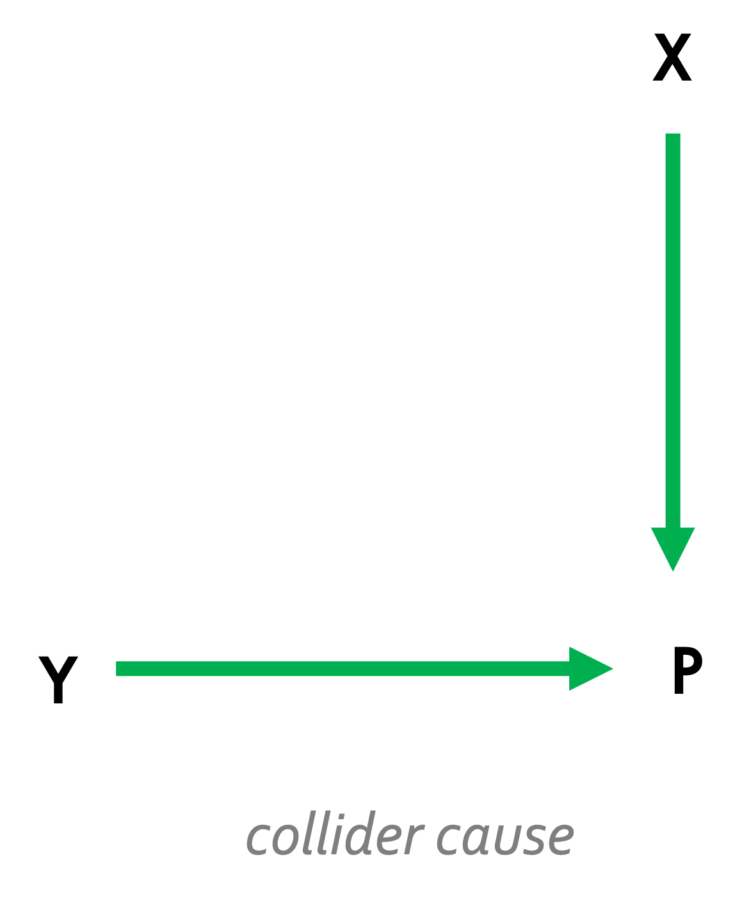

```{r setup, include=FALSE}
library(tinytex)
library(dplyr)
library(kableExtra)
knitr::opts_chunk$set(
    echo      = FALSE,
    message   = FALSE,
    warning   = FALSE,
    fig.pos   = "H",
    out.extra = ""
)

options(tinytex.verbose = TRUE)
```

```{=tex}
\allsectionsfont{\raggedright}
\subsectionfont{\raggedright}
\subsubsectionfont{\raggedright}
```
\pagenumbering{gobble}

````{=tex}
\begin{centering}

\vspace{3cm}

\vspace{1cm}

\Large
{\bf Utrecht University}

\Large
{\bf Faculty of Social and Behavioural Sciences}

\vspace{1cm}

\Large

\doublespacing
{\bf Network Analysis: A novel approach to the problem of nonresponse bias}

\vspace{1 cm}

\normalsize
\singlespacing
By

\vspace{0.5 cm}

\Large

{\bf SHANNON DICKSON}

\vspace{1.5 cm}

\Large
{\bf Methodology and Statistics for the Behavioural, Biomedical, and Social Sciences}

\vspace{1.5 cm}

\normalsize

Supervisors: \\
Dr Peter Lugtig \\
Dr Bella Struminskaya

\vspace{0.5cm}
Word count: 3355/6000

FETC Ethics Application Number: 22-2063

Student ID: 6369693

Target journal: Journal of Survey Statistics and Methodology

\end{centering}
````

\newpage

\pagenumbering{gobble}

\spacing{1.5}

# Introduction

Survey response rates have suffered a consistent decline in recent years [@beullensResponseRatesEuropean2018; @czajkaDecliningResponseRates2016; @brickExplainingRisingNonresponse2013; @schoeniResponseRatesNational2013; @andreskiResponseRatesNational2012; @lippsAttritionHouseholdsIndividuals2009]. One implication of poor response rates is the increased risk for survey errors like nonresponse bias. Smaller sample sizes also reduce statistical power, and the overall precision of estimates suffers [@lohrSamplingDesignAnalysis2021]. Traditional probability samples require a 100% response rate to achieve completely unbiased estimates. Consequently, practitioners are willing to spend a considerable portion of their survey budget on enhancing fieldwork efforts, advertising campaigns, and offering financial incentives to boost response rates [@sakshaugReducingNonresponseData2022; @mcgonagleEffectsIncentiveBoost2020; @beebeTestingImpactMixed2018; @lippsEffectsDifferentIncentives2010; @southernSamplingHardtoreachPopulations2008; @curtinEffectsResponseRate2000. The European Social Survey is a cross-national and longitudinal survey measuring attitudes, beliefs, and behaviours across countries in Europe. The ESS has an extensive fieldwork period of six weeks over the course of five months to achieve their target response rate of 70%. As such, fieldwork efforts have increased wave-to-wave with more non-contact attempts made, more attempts to convert refusals, increasing the use of prenotification and offering incentives to name a few [@beullensResponseRatesEuropean2018]. The overall cost of fieldwork comes to €4.2m [@essEuropeanSocialSurvey2016]. Yet, ESS response rates are still declining at each wave. Fortunately for the ESS, the differences between respondents and nonrespondents is minimal and nonresponse bias appears stable [@beullensResponseRatesEuropean2018]. 
A key question is if, given the empirical evidence, directing significant effort to maximising response rates is really worth it when reducing nonresponse bias is our goal. Adopting such an approach could actually produce more nonresponse bias than is expected intuitively, as was found in one simulation study [@beullensShouldHighResponse2012]. Some have voiced concern that converting unwilling respondents can increase the measurement error in a survey if the respondent is generally uninterested in the survey aims and this measurement error is linked to nonresponse bias [@tourangeauSensitiveTopicsReluctant2010]. Having a very long fieldwork period can similarly lead to increased nonresponse bias if certain types of individuals are more likely to respond early or late. A study by @struminskayaRiskNonresponseBias2022 found that a fieldwork period of 2 weeks is optimal in web surveys. This also indicates that the length of fieldwork should be determined by the point at which nonresponse bias is no longer significant, rather than when response rates reach equilibrium. The paradoxical trend of declining response rates that coincide with low nonresponse bias add further confusion. In a cross-national online survey conducted in Great Britain, Estonia, and Slovenia, the most representative sample came from the country with the lowest response rates (Great Brtain) [@maslovskayaRepresentativenessSixWaves2022]. Other auxiliary information was more indicative of nonresponse bias, such as age (in GB) and level of education (in Estonia and Slovenia). 

Several studies have found that response rates alone are a poor predictor of nonresponse bias [@kochAssessingESSSample2014; @leeExploringNonresponseBias2009; @grovesImpactNonresponseRates2008; @grovesNonresponseRatesNonresponse2006; @grovesExperimentsProducingNonresponse2006]. The most extensive work on this comes from two studies [@grovesImpactNonresponseRates2008; @grovesExperimentsProducingNonresponse2006]. In one, the authors attempted to produce nonresponse bias by experimentally manipulating survey design and response propensity. Participants were randomly assigned to survey topics they had varying degrees of interest in and that either offered incentives or not but failed to find any consistent pattern. In part, this was due to the different effects of survey mode on participation; in this case mail surveys yielded lower response rates as there was less opportunity to make the topic salient to respondents. In a second experiment, the authors compared the differences in estimates of the birding population by surveying those with and without a special interest in birding. The special interest group and the general group yielded very different estimates, but this practically vanished when incentives were offered to the disinterested group. @grovesExperimentsProducingNonresponse2006 concluded that the relationship between response rates and nonresponse bias is complex and that survey topic, mode, saliency, and incentives have the power to change this relationship. In a later meta-analysis of 59 different studies on nonresponse, the authors sought to extend these findings by incorporating a wider range of survey design features and sample attributes. Only mode (self- or interviewer-administered), sponsorship, population type (specific or general), and the type of question (behavioural, attitudinal, demographic) showed significant differences between respondents and nonrespondents. Specifically, bias was greater for interviewer-administered surveys, surveys involving the general population, and questions about attitudes [@grovesImpactNonresponseRates2008].

These studies demonstrate that nonresponse bias is a variable-specific phenomenon. A number of theoretical frameworks have been proposed over the years that explain why this is the case. Leverage-saliency theory [@grovesLeveragesaliencyTheorySurvey2000], response-propensity theory [@brickResponsiveSurveyDesigns2017], and benefit-cost theory [@singerBenefitCostTheorySurvey2011] all present a similar case: survey participation decisions balance the participation-benefits and participation-costs, certain aspects of a survey design have leverages on a person’s participation and the saliency of these leverages can be manipulated to increase their response propensity, and when response propensities are correlated with the survey outcome nonresponse bias occurs. Consensus on these theories has urged a shift in how we think about nonresponse bias. Unfortunately, many of the existing studies have important methodological drawbacks that compromise their claims. For instance, @grovesImpactNonresponseRates2008 meta-analysis suffered a small sample size that overrepresented self-administered surveys, health surveys, and limited them to simplistic bivariate analyses that are unlikely to capture the multivariate nature of nonresponse bias. Others focus on particular surveys and modes [@rybakSurveyModeNonresponse2023; @kohlerAllOddsRobustness2022; @mcgonagleEffectsIncentiveBoost2020; @bethlehemSelectionBiasWeb2010] or are based on theoretical simulations rather than empirical data [@huaLinkSurveyResponse2023; @beullensShouldHighResponse2012]. Another shortcoming is the limited use of causal inference in investigating the link between nonresponse and bias (but see @kohlerAllOddsRobustness2022 and @mercerTheoryPracticeNonprobability2017). 
In this paper, we first explain how nonresponse and nonresponse bias arise using different causal models of survey response. Next, we describe our own meta-analysis of surveys on nonresponse and analyse the statistical relations among a detailed set of design characteristics in the data using graphical network modelling. Our aim is to encourage more causal thinking when it comes to survey inference and to explore the utility of an innovative method for analysing causal structures in survey data.

# Background

## Nonresponse Bias

Nonresponse bias occurs when the sampled units (realised respondents) differ systematically from the non-sampled units (nonrespondents). The Total Survey Error (TSE) framework identifies nonresponse (along with noncoverage) as one of the major contributors to bias [@biemerTotalSurveyError2010]. Indeed, the American Association of Public Opinion Research (AAPOR) insist practitioners should be “maximising the number of people who respond to your survey” by increasing incentives, contact attempts, and converting refusals [@aaporBestPracticesSurvey2022]. The persistence of response rates as an indicator of survey quality may, in part, be due to this stance. Ad additional attraction is the theoretical simplicity with which nonresponse can relate to nonresponse bias, highlighted by the formila from @bethlehemReductionNonresponseBia1988 given below:


\begin{align*}
NR_{bias}(\bar{y}_r) &= \frac{\sigma_{p_i,\mu_i}}{\bar{P}} \\
\; \textrm{where}, \\
\bar{y}_r            &= \textrm{the value of the survey outcome}, \\
\sigma_{p_i,\mu_i}   &= \textrm{the covariance of survey outcome and response prepensity},\\
\bar{P}              &= \textrm{overall response propensity} \\
\end{align*}


Many researchers are even moving away from traditional probability-based sampling procedures in favour of lower cost nonprobability surveys that can be fielded faster and achieve higher response rates (typically at the cost of precision in estimates) [@@cornesseReviewConceptualApproaches2020]. It is standard for cross-sectional and longitudinal surveys always report response rates [@draugalisBestPracticesSurvey2008; @finchamResponseRatesResponsiveness2008] despite underwhelming or even contradicting evidence of its impact on bias [@hedlinThereSafeArea2020; @gummerAssessingTrendsDecomposing2019; @leeExploringNonresponseBias2009; @grovesExperimentsProducingNonresponse2006; @grovesImpactNonresponseRates2008; @keeterConsequencesReducingNonresponse2000]. Some have even called for new indicators of survey representativeness, the so-called R-indicators [@bethlehemIndicatorsRepresentativenessSurvey]. Before we conlude an abesence of a relation between response rate and nonresponse bias, we should consider the situations where one does give rise to the other and how we might control for this.

## Causal Mechanisms of Nonresponse Bias

Nonresponse is typically categorised as ignorable or non-ignorable [@hedlinThereSafeArea2020; @fayCausalModelsPatterns1986]. If nonresponse has no connection to the survey outcome, we can safely assume that it is missing completely at random (MCAR) [@littleStatisticalAnalysisMissing2002] and therefore is ignorable (i.e., nonresponse bias is not a concern). In surveys, this is why probability-based sampling is the gold standard. In probability surveys, all sampled units have an equal probability of responding and any associated missingness would be random. In the causal inference literature, this is called strong ignorability which has two requirements: exchangeability and positivity. Exchangeability is unconditional when data are MCAR. Conditional exchangeability is met when all possible confounding variables are known and measured for all of the sampled units such the causal effect is estimable when these variables are controlled for [@greenlandIdentifiabilityExchangeabilityEpidemiological1986]. In this case data are missing at random (MAR) [@littleStatisticalAnalysisMissing2002]. Positivity simply ascertains that all sampled units have an equal probability to participate in the survey [@hernanEstimatingCausalEffects2006; @petersenDiagnosingRespondingViolations2012]. Probability sampling ensures this. If positivity and (conditional) exchangeability are met, we can be confident that the composition of the sample is sufficiently alike the population to estimate causal effects. 
In reality, probability-sampling rarely achieves the 100% response rate required to guarantee the conditions for causality. Nonprobability sampling is also becoming more popular especially as online web surveys become commonplace [@cornesseReviewConceptualApproaches2020]. Numerous statistical methods have been developed to relate the sample back to the population when nonresponse is present and nonresponse bias is a concern [@toepoelDealingNonresponseStrategies2017; @leeSTATISTICALMETHODSREDUCING2011; @garyAdjustingNonresponseSurveys2007; @lundstromCalibrationMethodDeriving1999]. Still, conditional exchangeability (thus causal inference) relies on correctly specifying these models. It becomes obvious that understanding the complex mechanisms that give rise to nonresponse bias is pertinent to accurate estimation of causality in surveys. In the section below, we outline some potential mechanisms that give rise to nonresponse bias and threaten causal conclusions in surveys. 

## Graphical Models of Nonresponse Bias

Graphical causal models for survey inference are not a new idea [@kohlerAllOddsRobustness2022; @mercerTheoryPracticeNonprobability2017; @grovesNonresponseRatesNonresponse2006; @fayCausalModelsPatterns1986], but their is limited and mostly informal. Figure 1 depicts three causal models that have been adapted from @grovesNonresponseRatesNonresponse2006. In each of the causal graphs:

\begin{itemize}
\item $P$ is the propensity to respond
\item $Y$ is the estimated survey outcome
\item $Z$ and $X$ are independent survey variables
\end{itemize}

```{r, echo = FALSE, out.width ="70%", fig.cap ="Three causal graphs, adapted from Groves (2006). P is the latent response propensity and Y is the survey outcome. Z and X indicate separate potential causes for P and Y. Nonresponse bias occurs when P and Y are correlated (centre and right).", fig.align='center'}
knitr::include_graphics("img/dags_groves.png")
``` 

```{r, echo = FALSE, out.width ="25%", fig.cap ="Extension of the survey variable cause graph.", fig.align='center'}

```

The first scenario is the most ideal. Response propensity, $P$, and the survey outcome, $Y$, have independent and separate causes, $Z$ and $X$. Thus, it is impossible for a covariance to exist between the survey outcome and response propensities, and we do not expect any nonresponse bias. The center scenario illustrates a less desirable scenario where the survey outcome of interest at least partly causes response propensities to change. For example, a survey that intends to estimate the effectiveness of a new medication for depression may overestimate the benefits because people who responded well to the medication are more likely to respond. An extension of this scenario is also considered in Figure 2. Here, an additional independent variable, $X$, also affects the response propensity but is independent of $Y$. Because we are forced to rely on those who have a high response propensity, we may suffer from collider bias where a spurious connection between $X$ and $Y$ exists in-sample but not in the population. Continuing with our example, in addition to receiving more responses that are positive we may also receive more responses from women (it is often observed that women response more often to surveys than men [@beckerGenderSurveyParticipation2017; @elliottPatternsUnitItem2005]). As a result, a spurious correlation is induced where women seem to respond more positively to the new medication than men. Lastly, the in the scenario on the right response propensity, $P$, and the survey outcome, $Y$, share a common cause, $Z$. In our motivating example, $Z$ could be adherence to a treatment plan. Adherence affects the treatment outcome because better taking the medication consistently is of more benefit. Adherence also affects the propensity to respond because those who adhered are also more invested in their health and more likely to participate in health-related surveys. In the same way, those who did not adhere to the treatment plan are less likely to respond to avoid judgement. Again, we see a positive bias in our estimate of the treatment effect because response propensity and the survey outcome are related through their shared cause of treatment adherence. In the first scenario, the survey outcome and response propensity are d-separated (independent) (see @pearlCausalityModelsReasoning2009 for a thorough discussion of d-separation). In the latter scenarios nonresponse covaries with the survey outcome resulting in non-ignorable nonresponse bias. However, d-separation is possible by conditioning on the correct covariate. If we control for both gender and treatment adherence, with some statistical tricks, we can estimate a more accurate causal effect by blocking the spurious paths.

Although research has indicated that nonresponse bias is likely to be outcome-specific within surveys, there is a lack of consensus on which survey-related characteristics may induce a relationship between nonresponse and nonresponse bias at the between-survey level. Furthermore, some between-survey characteristics may influence those within-survey aspects that relate to nonresponse and bias [@tourangeauPresidentialAddress2017]. For instance, a health survey is intrinsically salient to those who are invested in their health, but this saliency can be increased for those less invested by introducing incentives. Our study aims to understand these complex mechanisms by estimating a structural network of conditional (in-)dependencies among a broader set of survey design characteristics and with a much greater sample size than previous meta-analysis. In doing this, we also discuss the utility of network modelling as a potential method for causal inference in surveys. In the next section we describe our data collection and analysis methods. 

# Method

## Aim

We aim to use statistical networks to describe the conditional relations between nonresponse and nonresponse bias, accounting for survey design. We initially conducted a systematic meta-analysis of literature reporting nonresponse and nonresponse bias in surveys. As it stands, this is the first application of a network approach to nonresponse analysis. Our results will hopefully inform survey designers who wish to minimize nonresponse bias. 

## Systematic Meta-Analysis

### Eligibility Criteria and Search Strategy

Our search strategy was based on the strategy used in the original review by @grovesImpactNonresponseRates2008. A list of key search terms was taken from @grovesImpactNonresponseRates2008 and expanded to include all relevant key words related to nonresponse rates and nonresponse bias. Some examples of these terms include "response bias", "nonresponse bias", "selection bias", "survey bias", and "participation rates". Articles were primarily identified from five electronic databases (Google Scholar, Web of Science, Scopus, Web Survey Methodology, and PsychInfo) in 2021. Searches of conference proceedings (e.g., American Statistical Association Survey Research Methods Section), articles cited in book chapters (e.g., the Wiley Series in Survey Methodology), and internet Google searches using the key search terms were also conducted to capture a wider range of articles and grey literature. Eligible articles met these criteria:

\begin{enumerate}
    \item The study is empirical and about nonresponse rates
    \item A probability-sample is drawn from a population
    \item A survey is conducted
    \item Sample frame information is collected on respondents and nonrespondents. 
\end{enumerate}

 Articles originating from @grovesImpactNonresponseRates2008 were automatically included. Panel studies were excluded in addition to articles that did not mention nonresponse rates and nonresponse bias. All articles were published between 1978 and 2020.


### Screening phase

ASReview (v0.19.1) [@vandeschootOpenSourceMachine2021] screened the literature from the initial search. A random sample of articles was coded as relevant or irrelevant by five independent coders. Coded articles served as training input to the ASReview which classified the remaining literature. ASReview results were divided across the coders who manually screened article abstracts or full-texts for quality until 25 consecutive articles were coded irrelevant. Articles incorrectly classified as irrelevant by ASReview were corrected before coding, resulting in 113 articles and 3301 estimates.

### Coding phase

113 studies were divided across five independent coders instructed to record all relevant characteristics of the study. Discrepancies were resolved by discussion. See Appendix: Table 1 for an overview.

### Calculation of nonresponse rate

Nonresponse rate is defined as a percentage of all the potentially eligible units that do not respond to the items in a survey. Unit nonresponse rates were calculated in our study, where all data from a sampled respondent are missing.
\
Response rate is calculated as:


\begin{align*}
RR &= 100*\frac{n_R}{n_E} \\ 
\textrm{where}, \\
n_R &= \textrm{the number of eligible units in the responding sample}, \\
n_E &= \textrm{is the total number of eligible units invited to respond}. \\
\end{align*}


### Calculation of nonresponse bias

Nonresponse bias consists of two components: nonresponse rates and the difference between respondents and nonrespondents on an estimate. We calculate the absolute relative bias in the same manner as @grovesImpactNonresponseRates2008:


\begin{align*}
Bias(\hat{y}_r) &=  \left\lvert\frac{100*(\hat{y_r} - \hat{y_n})}{\bar{y_n}}\right\rvert \\ 
\; \textrm{where}, \\
\hat{y_r} &= \textrm{the survey estimate for respondents},  \\
\hat{y_n} &= \textrm{the survey estimate for nonrespondents},  \\
p_n       &= \textrm{the nonresponse rate.}  \\
\end{align*}

## Network Analysis

Network models are families of probability distributions that satisfy several conditional (in)-dependency statements represented in an undirected graph [@haslbeckStructureEstimationMixed2015]. An undirected graph $G = (V, E)$ consists of nodes $\mathit{V = \{1, 2,..., p\}}$ and edges $\mathit{E \subseteq V * V}$. In our study, nodes represent survey design characteristics (e.g., mode, topic, saliency, nonresponse, bias) and edges connecting nodes represent statistical relations among them. Since we have data of mixed type (continuous, cateogrical) we opted to use mixed graphical modelling. 

### Mixed Graphical Models

Mixed Graphical Models (MGMs; [@haslbeckStructureEstimationMixed2015; @chenSelectionEstimationMixed2015; @yangMixedGraphicalModels2014]) are probabilistic graphical models reflecting the joint probability density of multiple variables that follow different distributions. Each node is therefore associated with a different conditional exponential family distribution. Specifically, the pairwise interaction between two continuous variables, $\mathit{s}$ and $\mathit{r}$, is given by a single parameter, $\theta_{s,r}$. $\theta_{s,r}$ represents if the interaction is non-zero. Pairwise interactions between two categorical variables, $\mathit{m}$ and $\mathit{u}$ are given by $\mathit{R = (m-1)*(u-1)}$ parameters associated with corresponding indicator functions (dummy variables) associated with $\mathit{R}$ states. Pairwise interactions between a continuous and a categorical variable is given by $\mathit{R = 1*(m-1)}$ parameters associated with $\mathit{(m-1)}$ corresponding indicator functions for all $\mathit{R}$ states [@haslbeckMgmEstimatingTimeVarying2020]

There are two steps in estimating the parameters for the MGM. First, the conditional distribution of each node is estimated separately using generalized linear regression. There are two estimates for each node that are averaged in a second step into one network structure. Edges represent the averaged nodewise regressions. In additional estimation steps, we specify an *"AND"* rule that only retains edges where both nodewise estimates are non-zero. The Extended Bayesian Information Criterion (EBIC) is selected as a regularization parameter to prevent overfitting.

**Software**

All analysis is conducted using R version 4.1.2. Estimation is implemented in the  `mgm` package [@haslbeckMgmEstimatingTimeVarying2020], network visualization by the `qgraph` package [@epskampQgraphNetworkVisualizations2012], and bootstrapping by the `bootnet` package [@epskampEstimatingPsychologicalNetworks2018].

# Results

## Descriptive Analysis

```{r}
library(gtsummary)
data <- readRDS("../../analysis/data/data.RDS") %>% 
  select(Mode, Topic_Health, Qtype, special_population, Saliency, Incentivised, Reminder, Sponsorship)
data %>%
  tbl_summary(by           = Mode,
              sort         = all_categorical() ~ "frequency",
              statistic    = list(all_categorical() ~ "{n} ({p}%)"),
              missing      = "ifany",
              missing_text = "Unknown",
              label        = list(vars(Topic_Health)       ~ "Topic",
                                  vars(Qtype)              ~ "Question type",
                                  vars(special_population) ~ "Special population",
                                  vars(Saliency)           ~ "Saliency of topic",
                                  vars(Incentivised)       ~ "Incentives given ",
                                  vars(Reminder)           ~ "Reminders sent",
                                  vars(Sponsorship)        ~ "Sponsored"
                                  ),
              type        = list(c(Topic_Health, Qtype, special_population, Saliency, Incentivised, Reminder, Sponsorship) ~ "categorical")) %>% 
  
  bold_labels() %>% 
  add_n() %>% 
  modify_header(label ~ "Survey Characteristic") %>% 
  modify_spanning_header(c("stat_1", "stat_2", "stat_3", "stat_4", "stat_5") ~ "**Primary Survey Mode**") %>% 
  modify_table_body(~.x %>% dplyr::mutate(stat_1 = ifelse(stat_1 == 0 | stat_1 == "0 (0%)", "-", stat_1),
                                          stat_2 = ifelse(stat_2 == 0, "-", stat_2),
                                          stat_3 = ifelse(stat_3 == 0, "-", stat_3),
                                          stat_4 = ifelse(stat_4 == 0, "-", stat_4),
                                          stat_5 = ifelse(stat_5 == 0, "-", stat_5))) %>% 
  modify_footnote(everything() ~ NA) %>% 
  as_kable_extra(booktabs = TRUE, longtable = TRUE, linesep = "",
                 caption   = "Descriptive statistics for the survey characteristics") %>% 
  kableExtra::kable_classic(position = "left", full_width = F) %>% 
  row_spec(0, bold = TRUE) %>% 
  row_spec(c(4,9,16,20,24,28), italic  = TRUE) %>% 
  footnote(general_title = "Statistics:",
           general       = "<i>% (n)</i>", escape = FALSE)
```

## Nonresponse Rates and Bias

### Old and new studies

**Table 1** compares the mean rate of nonresponse and nonresponse bias in the original studies from the meta-analysis by Groves and Peytcheva (2008) and the new studies from our literature search. Compared to the studies from their meta-analysis, nonresponse rates and nonresponse bias is higher in the newly found studies.

```{r}
t1_groves <- readRDS("../../analysis/tables/t1_groves.RDS")

t1_groves %>% 
  kbl(col.names = c("Studies", "Nonresponse Rate", "Absolute Relative Bias", "N"), 
      digits    = 2,
      align     = c("l", "c", "c"),
      booktabs  = T,
      linesep   = "",
      caption   = "NR and NRB in the current meta-analysis compared to an earlier meta-analysis") %>% 
  kable_classic(position      = "left",
                latex_options = "HOLD_position",
                full_width    = F) %>% 
  column_spec(c(1, 2, 3), width = "12em") %>% 
  column_spec(1, bold = T) %>% 
  row_spec(0, bold    = T) %>% 
  footnote(general    = "Nonresponse rate and absolute relative bias are expressed as a percentage.")
```


```{r, echo = FALSE, out.width="75%", fig.cap ="Distribution of Nonresponse Rate and Bias across Modes", fig.align='center'}
knitr::include_graphics("../../analysis/img/p_all_cors.png")
```

### Modes


```{r}
t2_modes <- readr::read_csv("../../analysis/tables/t2_modes.csv")

t2_modes %>% 
  kbl(digits   = 2,
      align    = c("l", "c", "c"),
      booktabs = T,
      linesep  = "",
      caption  = "Nonresponse rates and absolute relative bias by survey mode") %>% 
  kable_classic(position      = "left",
                latex_options = "HOLD_position",
                full_width    = F) %>% 
  column_spec(c(1, 2, 3), width = "12em") %>% 
  column_spec(1, bold = T) %>% 
  row_spec(0, bold = T) %>% 
  footnote(general = "Nonresponse rate and absolute relative bias are expressed as a percentage.")
```

```{r, echo = FALSE, out.width="75%", fig.cap ="Distribution of Nonresponse Rate and Bias across Modes", fig.align='center'}
knitr::include_graphics("../../analysis/img/p_mode_dists.png")
```

\newpage

### Information Source for Nonrespondents

**Table 3** shows mean rate of nonresponse and nonresponse bias for the different sources of information on nonrespondents. In most cases, information on nonrespondents came from the sampling frame and this source of information also has the greatest bias. By contrast, relatively few studies obtained nonrespondent information based on sampled members intentions to respond, but this source has the least bias. 

```{r}
t3_source <- readr::read_csv("../../analysis/tables/t5_source.csv")

t3_source %>% 
  kbl(digits   = 2,
      align    = c("l", "c", "c"),
      booktabs = T,
      linesep  = "",
      caption  = "Nonresponse rates and absolute relative bias by source") %>% 
  kable_classic(position      = "left",
                latex_options = "HOLD_position",
                full_width    = F) %>% 
  column_spec(c(1, 2, 3), width = "12em") %>% 
  column_spec(1, bold = T) %>% 
  row_spec(0, bold = T) %>% 
  footnote(general = "Nonresponse rate and absolute relative bias are expressed as a percentage.")  
```

### Country

```{r}
t4_country <- readr::read_csv("../../analysis/tables/t4_country.csv")
      
t4_country %>% 
  kbl(digits   = 2,
      align    = c("l", "c", "c"),
      booktabs = T,
      linesep  = "",
      caption  = "Nonresponse rates and absolute relative bias by country") %>% 
  kable_classic(position      = "left",
                latex_options = "HOLD_position",
                full_width    = F) %>% 
  column_spec(c(1, 2, 3), width = "12em") %>% 
  column_spec(1, bold = T) %>% 
  row_spec(0, bold = T) %>% 
  footnote(general = "Nonresponse rate and absolute relative bias are expressed as a percentage.")    
```

# Network Models

## All Modes

```{r, echo = FALSE, out.width="100%", fig.cap ="MGM of Survey Characteristics", fig.align='center'}
knitr::include_graphics("../../analysis/img/mgm_all_preds.png")
```


* Estimating the MGM on the entire dataset that includes face-to-face, web, mail, and paper survey modes results in a very dense network (**Figure 3**).
* Of interest is the connections to nonresponse bias (1) and nonresponse rates (2). A positive edge between these two nodes is driven by a direct effect of nonresponse rates on nonresponse bias. Specifically, a one unit increase in nonresponse rates leads to a 0.19 unit increase in nonresponse bias. Conversely, the regression in the opposite direction is estimated to be zero. 
* Survey mode (11) is also connected to nonresponse bias (1) and nonresponse rate (2). Paper surveys are the reference category, relative to which nonresponse rates decrease for face-to-face (-1.23), mail (-0.34), and telephone (-0.47). Nonresponse rates for web surveys do not differ from paper surveys. Nonresponse bias only decreases for mail surveys relative to paper surveys (-0.04 ). 
* The type of question asked is connected to nonresponse bias, whereby it decreases for unobservable characteristics relative to demographic characteristics
* Nonresponse rates increase when surveys are fielded in special populations (0.46), when participants are incentivised (0.24), when surveys are salient (0.15). Conversely, nonresponse rates decreases for health surveys (-0.14), sponsored surveys (-0.34), when reminders are used (-0.12).

**Other:**

* Face-to-face and web surveys are less likely to be incentivised than mail, paper, and telephone surveys. 
* Web surveys less salient. Mail surveys more salient. 
* Telephone surveys more likely to be sponsored.
* Face-to-face and paper more likely to be health surveys. 
* Face-to-face and telephone surveys more likely to be fielded in special populations. 
    

\newpage

## Network: Face-to-Face Mode

```{r, echo = FALSE, out.width="100%", fig.cap ="MGM of F2F Survey Characteristics", fig.align='center'}
knitr::include_graphics("../../analysis/img/mgm_f2f_preds.png")
```


* Bias decreases 0.29 if a f2f survey is salient to the respondent
* Bias decreases 0.42 if a f2f survey uses incentives
* As bias increases, the probability of survey not detailing reminders increases 0.85
* Bias decreases -0.097 in health surveys. 
* As bias increases, question type is less likely to be demographic.
* NR decreases 2.29 if a survey is salient
* NR increases 2.69 if a survey uses reminders, and by 0.86 for undetermined
* NR increases 1.03 for health surveys
* NR increases 1.73 if survey is for a special population
* NR increases 0.74 for observable questions / decreases for demographic

\newpage

## Network: Mail Mode

```{r, echo = FALSE, out.width="100%", fig.cap ="MGM of Mail Survey Characteristics", fig.align='center'}
knitr::include_graphics("../../analysis/img/mgm_mail_preds.png")
```

* Again, a very dense network. 
* Nonresponse rates and nonresponse bias are connected, where a unit increase in nonresponse rates cause a 0.21 unit increase in nonresponse bias. 
* Nonresponse bias is also connected to reminders and question type. As nonresponse bias increases, more likely to be surveys where reminders could not be determined. Similarly, as nonresponse bias increases, questions are more likely to be demographic (0.14) and less likely to be unobservable (-0.13).
* Nonresponse rates are connected to question type (-0.37), special population (0.63), health surveys (-0.15), sponsorship (-0.35), reminders (-0.09 when used), incentives (0.22), saliency (0.19) and year (0.06). 

\newpage

## Network: Web Mode

```{r, echo = FALSE, out.width="100%", fig.cap ="MGM of Web Survey Charactersitcs", fig.align='center'}
knitr::include_graphics("../../analysis/img/mgm_web_preds.png")
```

* Nonresponse rates and nonresponse bias not connected.
* Nonresponse bias connected to question type (3.24 for observable) and reminders (0.29 for using reminders).
* Nonresponse rates connected to question type (-1.32 observable, 0.34 unobservable), special populations (0.83), health surveys (0.35), reminders (0.85 for using reminders), incentives (1.75), saliency (0.65). 

\newpage

## Network: Telephone Mode

```{r, echo = FALSE, out.width="100%", fig.cap ="MGM of Telephone Survey Characteristics", fig.align='center'}
knitr::include_graphics("../../analysis/img/mgm_tel_preds.png")
```


* Nonresponse rates and nonresponse bias not connected.
* Nonresponse bias only connected to the use of reminders, where bias increases by 0.44 units when reminders are “undetermined”.
* Nonresponse rates are connected to health survey (-0.63), sponsorship (-1.19), reminders (-0.67 for using reminders and 0.75 for undetermined), and year (0.16). 


\newpage

# References

<div id="refs"></div>

# Appendix

## Network Weighted Adjacency Matrices

### All surveys

```{r, echo=FALSE}
mgm_all_pairwise <- readRDS("../../analysis/data/output/mgm_all_pairwise.RDS")
mgm_all_nodewise <- readRDS("../../analysis/data/output/mgm_all_nodewise.RDS")

mgm_all_pairwise %>% 
  kbl(digits = 3,
      align = "l",
      booktabs = TRUE,
      linesep = "",
      caption = "Avereaged Interactions") %>% 
  kable_classic(latex_options = "HOLD_position",
                full_width = TRUE) %>% 
  row_spec(0, bold = TRUE)

mgm_all_nodewise %>% 
  kbl(digits = 3,
      align = "l",
      booktabs = TRUE,
      linesep = "",
      caption = "Nodewise Interactions") %>% 
  kable_classic(position = "left",
                latex_options = "HOLD_position",
                full_width = TRUE) %>% 
  row_spec(0, bold = TRUE)
```

### F2F surveys

```{r, echo=FALSE}
f2f_pairwise <- readRDS("../../analysis/data/output/mgm_f2f_pairwise.RDS")
f2f_nodewise <- readRDS("../../analysis/data/output/mgm_f2f_nodewise.RDS")

f2f_pairwise %>% 
  kbl(digits = 3,
      align = "l",
      booktabs = TRUE,
      linesep = "",
      caption = "Avereaged Interactions") %>% 
  kable_classic(latex_options = "HOLD_position",
                full_width = TRUE) %>% 
  row_spec(0, bold = TRUE)

f2f_nodewise %>% 
  kbl(digits = 3,
      align = "l",
      booktabs = TRUE,
      linesep = "",
      caption = "Nodewise Interactions") %>% 
  kable_classic(position = "left",
                latex_options = "HOLD_position",
                full_width = TRUE) %>% 
  row_spec(0, bold = TRUE)
```

### Web surveys

```{r, echo=FALSE}
web_pairwise <- readRDS("../../analysis/data/output/mgm_web_pairwise.RDS")
web_nodewise <- readRDS("../../analysis/data/output/mgm_web_nodewise.RDS")

web_pairwise %>% 
  kbl(digits = 3,
      align = "l",
      booktabs = TRUE,
      linesep = "",
      caption = "Avereaged Interactions") %>% 
  kable_classic(latex_options = "HOLD_position",
                full_width = TRUE) %>% 
  row_spec(0, bold = TRUE)

web_nodewise %>% 
  kbl(digits = 3,
      align = "l",
      booktabs = TRUE,
      linesep = "",
      caption = "Nodewise Interactions") %>% 
  kable_classic(position = "left",
                latex_options = "HOLD_position",
                full_width = TRUE) %>% 
  row_spec(0, bold = TRUE)
```

### Mail surveys

```{r, echo=FALSE}
mail_pairwise <- readRDS("../../analysis/data/output/mgm_mail_pairwise.RDS")
mail_nodewise <- readRDS("../../analysis/data/output/mgm_mail_nodewise.RDS")

mail_pairwise %>% 
  kbl(digits = 3,
      align = "l",
      booktabs = TRUE,
      linesep = "",
      caption = "Avereaged Interactions") %>% 
  kable_classic(latex_options = "HOLD_position",
                full_width = TRUE) %>% 
  row_spec(0, bold = TRUE)

mail_nodewise %>% 
  kbl(digits = 3,
      align = "l",
      booktabs = TRUE,
      linesep = "",
      caption = "Nodewise Interactions") %>% 
  kable_classic(position = "left",
                latex_options = "HOLD_position",
                full_width = TRUE) %>% 
  row_spec(0, bold = TRUE)
```

### Telephone surveys

```{r, echo=FALSE}
tel_pairwise <- readRDS("../../analysis/data/output/mgm_tel_pairwise.RDS")
tel_nodewise <- readRDS("../../analysis/data/output/mgm_tel_nodewise.RDS")

tel_pairwise %>% 
  kbl(digits = 3,
      align = "l",
      booktabs = TRUE,
      linesep = "",
      caption = "Avereaged Interactions") %>% 
  kable_classic(latex_options = "HOLD_position",
                full_width = TRUE) %>% 
  row_spec(0, bold = TRUE)

tel_nodewise %>% 
  kbl(digits = 3,
      align = "l",
      booktabs = TRUE,
      linesep = "",
      caption = "Nodewise Interactions") %>% 
  kable_classic(position = "left",
                latex_options = "HOLD_position",
                full_width = TRUE) %>% 
  row_spec(0, bold = TRUE)
```

